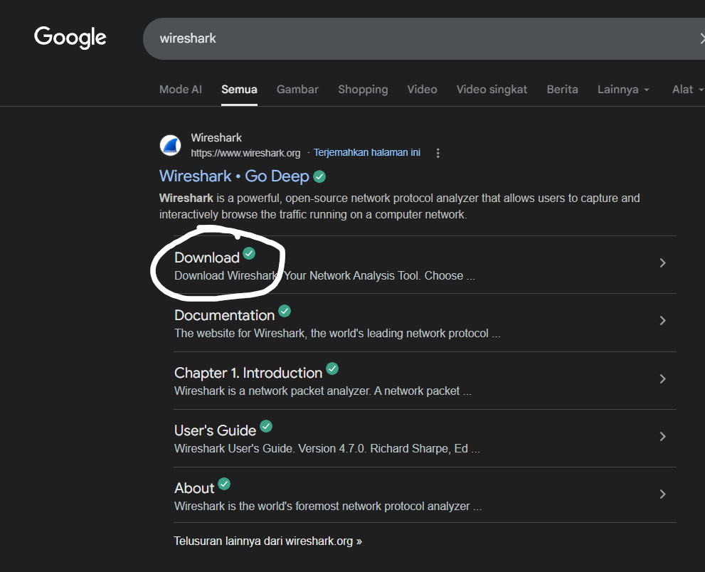
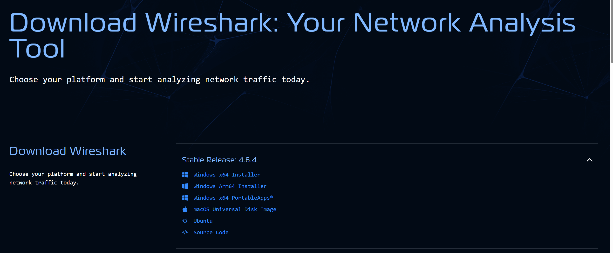

# Laporan Praktikum Minggu 1, Modul 1

## Tujuan
- Tau cara instalasi wireshark
- tau cara menggunakannya

## Cara Instal Wireshark
1. Buka Aplikasi browser pada leptop (bebas aplikasi browser apa saja) atau bisa klik link ini : https://www.wireshark.org/download.html
2. ketik di pencarian 'Wireshark' lalu enter
3. Setelah itu pilih yang opsi download
    
4. Lanjut pilih versi yang stabil terbaru
5. Download yang sesuai dengan os (windows x64 installer misalnya)
    
6. tunggu sampe downloadnya selesai.
7. jika sudah, lanjut buka file tersebut.
8. jika sudah muncul gambar setup instal aplikasinya, klik next.
    
9. Selanjutnya kalian bisa baca License Agreementnya, jika sudah klik noted.
    
10. lanjut klik next lagi.
    
11. Selanjutnya pilih komponen yang mau diinstall, sesuaikan saja dengan kebutuhan. jika sudah klik next
    
12. jika sudah, sesuaikan dengan kebutuhan, lalu klik next.
    
13. Selanjutnya pilih lokasi untuk menyimpan file program wiresharknya, jika sudah klik next.
    
14. jika sudah (sesuaikan dengan kebutuhan), klik next lagi.
    
15. Selanjutnya juga sama, jika sudah tinggal klik install.
    
16. Tunggu hingga selesai, jika sudah lalu klik next.
    
17. Jika sudah lalu klik finish.

# Selamat Kita Telah Selesai Menginstall Wireshark
