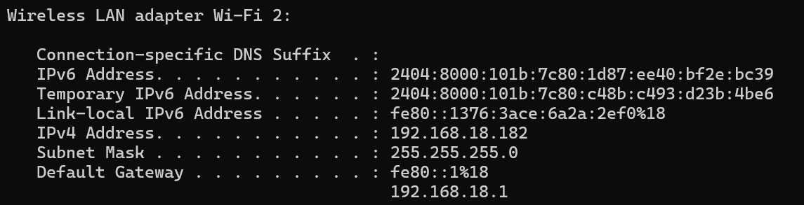
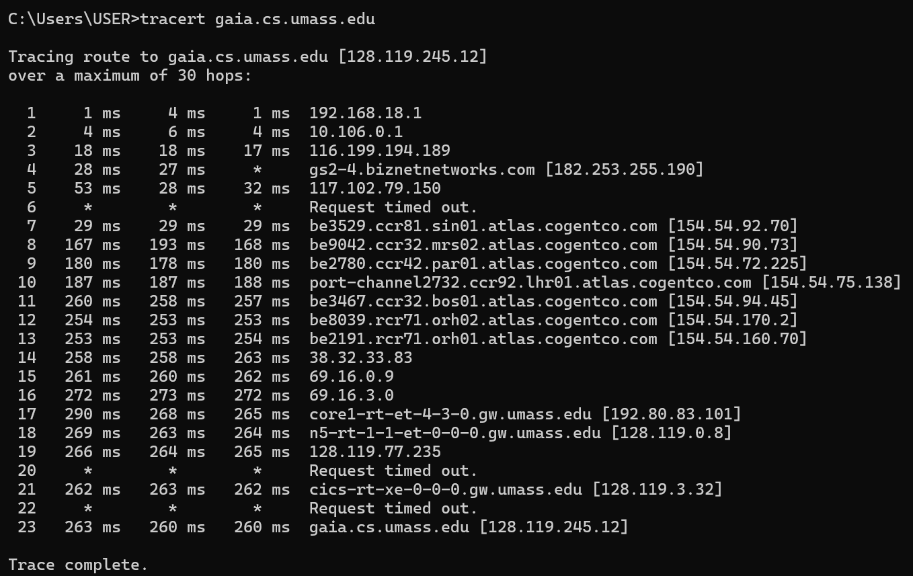
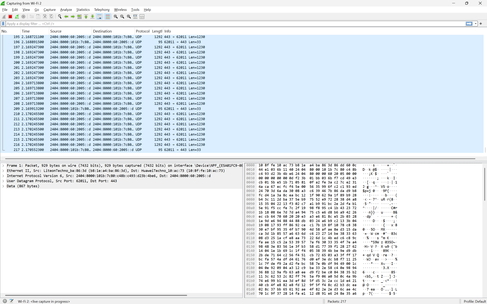
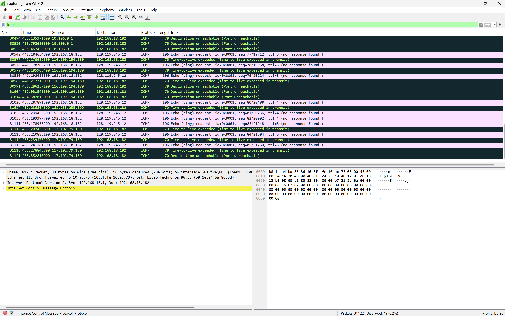
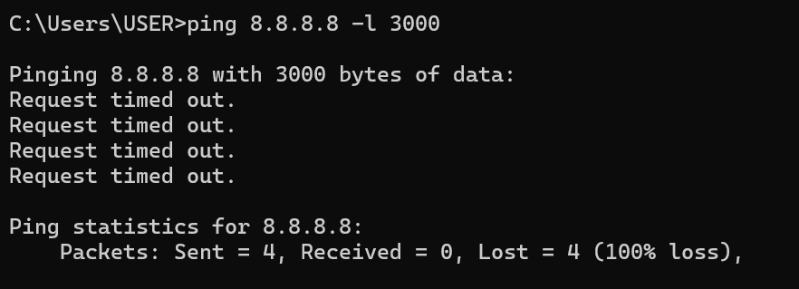
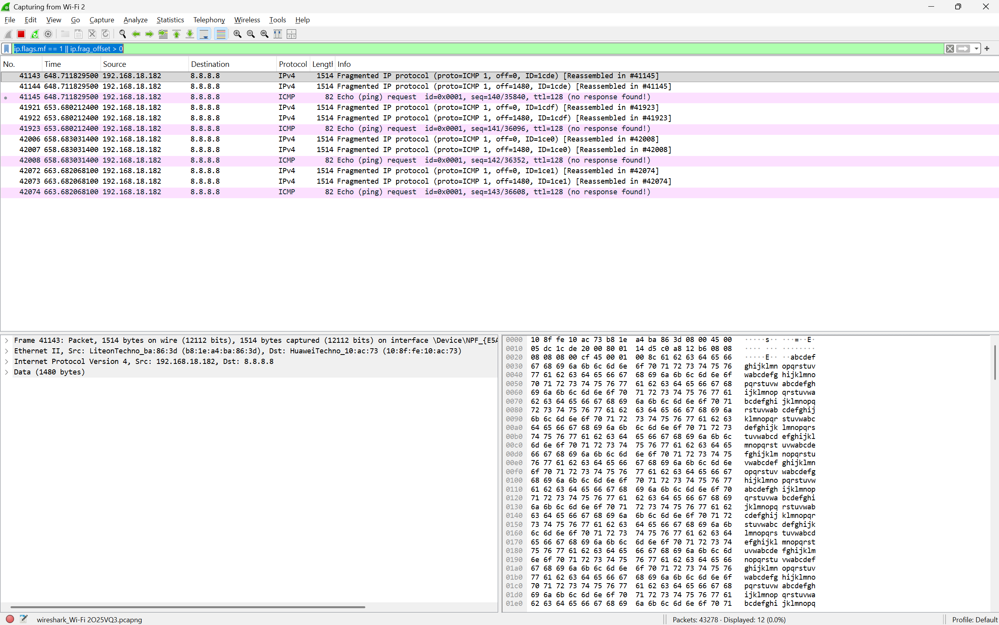
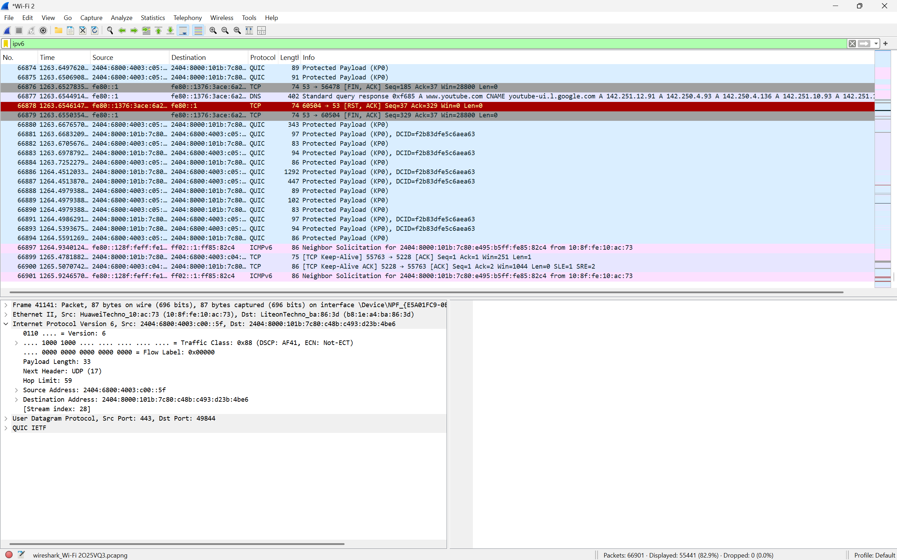

```
Nama    : I Made Sudiarte
NIM     : 103072400044
Kelas   : IF-04-05
```
# Laporan Praktikum Jaringan Modul 10 - IP
## A. Pengenalan
    IP adalah singktana dari internet protokol, yakni alamat yang digunakan perangkat untuk melakukan komunikasi, jenisnya, yakni.

        1. IPv4 dan IPv6 (32-bit dan 128-bit)
        2. Public dan Private IP Address

    fungsinya :
    
        1. alamat tujuan paket akan dikirim
        2. identitas  suatu perangkat
## B. Pengecekan IP Address
1. Buka cmd dan ketik ipconfig, lalu enter
        
2. scroll kebawah, cari bagian wifi adapter/wireless/modul wifi.
        
3. gambar di atas beripakan hasil dari ipconfig, dimana itu menampilkan ip address dari device kita

## C. Menangkap Paket Dari Eksekusi Traceroute
Dengan perintah traceroute Linux/MacOS, ukuran datagram UDP yang dikirim ke tujuan akhir dapat diatur secara eksplisit dengan menunjukkan jumlah byte dalam datagram; nilai ini dimasukkan dalam baris perintah traceroute segera setelah nama atau alamat tujuan. Misalnya, untuk mengirim datagram traceroute 2000 byte ke gaia.cs.umass.edu, perintahnya adalah:
```
%traceroute gaia.cs.umass.edu 2000
```
untuk windows :
1. buka cmd, dan ketik :
```
tracert gaia.cs.umass.edu 10
```
perintah di atas akan melakukan traceroute dengan batas maksimum hop default 30 hop.
2. hasilnya :
    
gambar di atas  menunjukan jalur yang dilewati paket data dari komputer kita menuju gaia.cs.umass.edu.

Jika menggunakan wireshark + cmd :
1. Buka wireshark
2. lakukan capturing pada jaringan yang kalian gunakan (contoh wifi adapter)
    
3. Buka cmd, lalu jalankan.
```
tracert gaia.cs.umass.edu
```
4. Balik ke wireshark, filtering dengan kata icmp.
5. hasil :



## D Fragmentasi
Fragmentasi, yakni proses memecah paket IP yang ukurannya terlalu besar menjadi beberapa bagian (fragmen) yang lebih kecil agar dapat melewati jaringan yang memiliki batas ukuran paket tertentu.
contoh :
1. Buka wireshark
2. lakukan capturing pada jaringan yang kalian gunakan (contoh wifi adapter)
    
3. Buka cmd, dan ketik:
```
ping 8.8.8.8 -l 3000
```
8.8.8.8 adalah server DNS publik milik Google

4. Balik kewireshark, filtering menggunakan kata: 
```
 ip.flags.mf == 1 || ip.frag_offset > 0
 ```
5. hasil :


## E. IPv6
Berikut langkah untuk melihat protokol jaringan IPV6 di wireshark
1. Buka wireshark
2. lakukan capturing pada jaringan yang kalian gunakan (contoh wifi adapter)
    
3. Lakukan Filtering dengan kata:
```
ipv6
```
4. Hasil :
