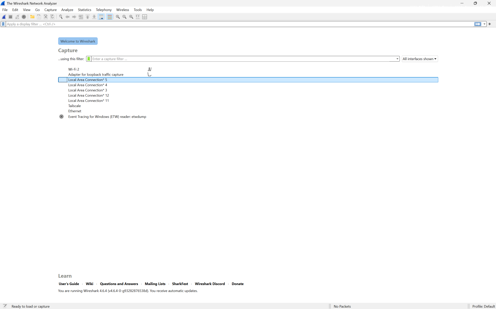
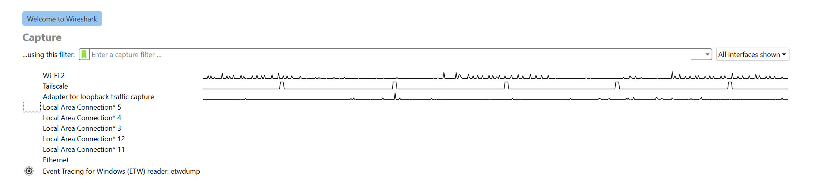
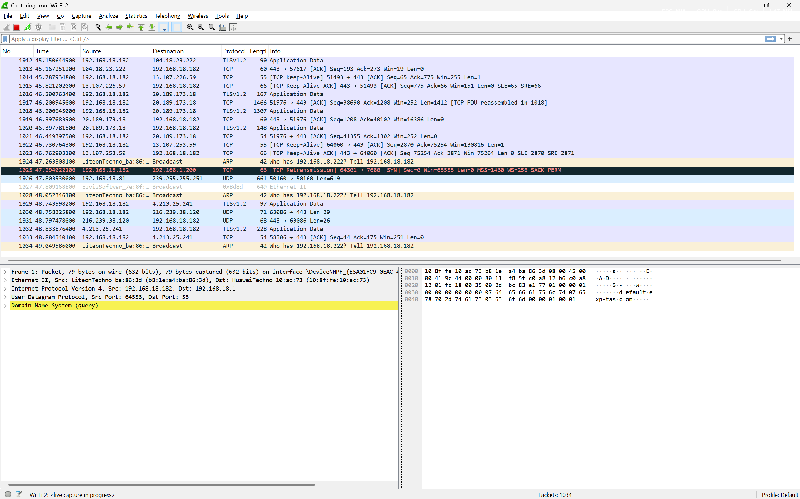
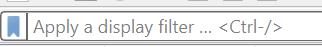
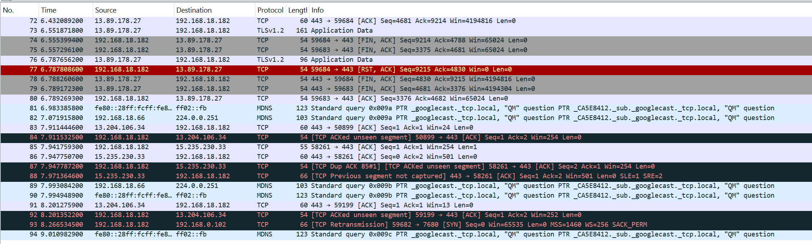

## Pengenalan Tools
# Wireshark 

Wireshark adalah sebuah aplikasi dimana aplikasi tersebut digunakan untuk penganalisis jaringan sumber terbuka yang banyak digunakan dan dapat menangkap serta menampilkan detail lalu lintas jaringan secara real-time. aplikasi ini juga biasa digunakan untuk memecahkan masalah jaringan, menganalisis protokol jaringan, dan memastikan keamanan jaringan.

1. Tampilan Awal Wireshark

Gambar di atas menunjukan beberapa beberapa interface, yakni 
- WI-FI 2 (adapter jaringan utama pada leptop/pc)
- Tailscale, ini semacam vpn dari tailscale
- Adapter for loopback traffic captur, ini buat nangkap traffic lokal / lalu lintas jaringan lokal
- Local Area Connection, ini adapter virtual jaringan
- Ethernet, ini jalur konteksi dari kabel lan

2. Contoh Capturing dari Wi-Fi 2

3. Bagian Dari Gambar

pada gambar gambar di atas, terdapat beberapa button, yakni :
- gambar sirip hiu, digunakan untuk memulai capturing lalu lintas jaringan pada Wi-Fi 2
- gambar persegi 4, digunakan untuk memberhentikan capturing
- gambar sirip hiu dengan logo ulangi di dalamnya, ini digunakan untuk meriset capturing yang sedang berjalan.
- gambar bulat ada gear di dalamnya, ini digunakan untuk opsi memilih interface yang ingin dicapturing

gambar di atas digunakan untuk filter tampilan.

Gambar di atas merupakan tampilan dari  lalu lintas jaringan dari interface Wi-Fi 2, di mana terdapat nomor paket, waktu paket diterima, alamat pengirim paket, alamat tujuan, jenis protocol, ukuran paket, dan info dari paket tersebut.

# Pustaka
 (sumber : https://www.techtarget.com/whatis/definition/Wireshark)
