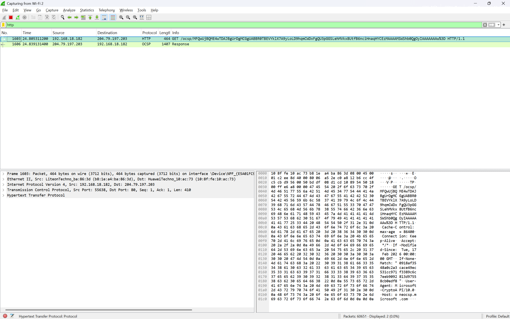
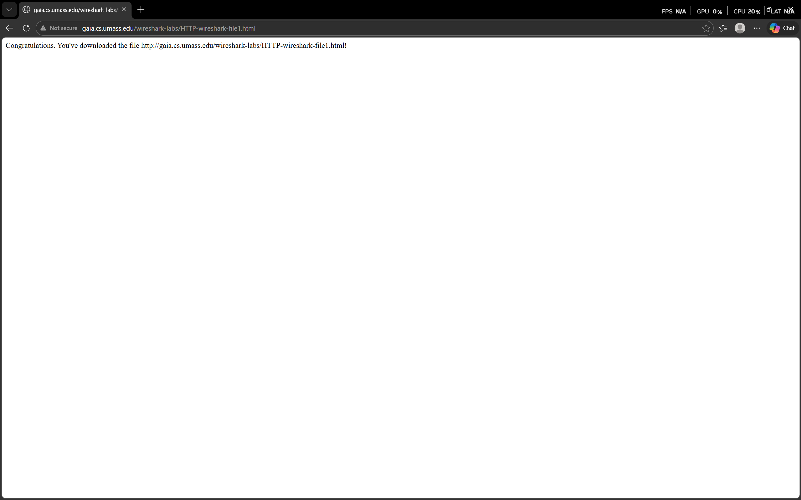
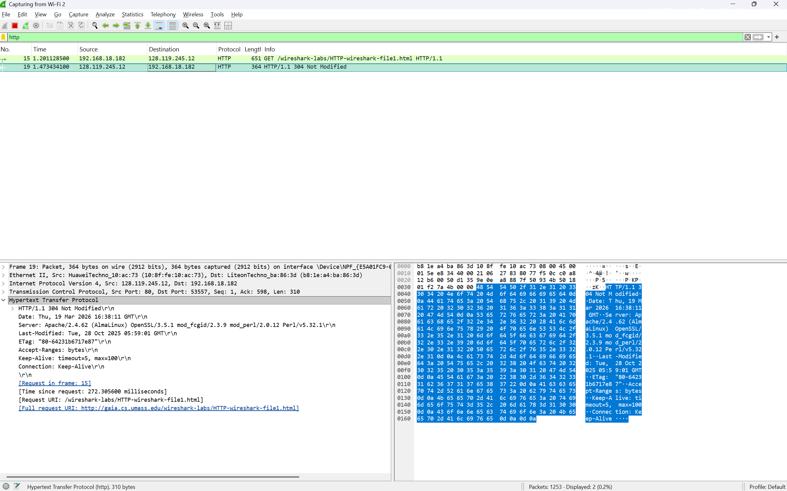

## Laporan Prakktikum Jaringan Komputer Modul 3 Terkait HTTP
- Nama          : I Made Sudiarte
- NIM           : 103072400044
- Kelas         : IF-04-05

# Tujuan Praktikum
- Mahasiswa dapat menginvestigasi cara kerja protokol HTTP menggunakan Wireshark.

# Percobaan

# Melakukan Capturing Wifi 2 Pada Wireshark

Tampilan Awal

1 Langkah awal yang kita lakukan adalah filter tampilan capturing dengan mengetik "http" pada kolom filter lalu enter

tampilanya akan seperti gambar di bawah 

2 Selanjutnya Kita membuka tautan berikut : http://gaia.cs.umass.edu/wireshark-labs/HTTP-wireshark-file1.html pada browser dan pastikan linknya http bukan https, jika sudah maka tampilanya akan seperti gambar di bawah 

3. Masuk ke Wiresharknya, cek lalu lintas capturing yang sudah difilter tadi, maka akan terdapat 2 lalu linta jaringan dengan protokol http, karena kita sudah membuka link di atas.

