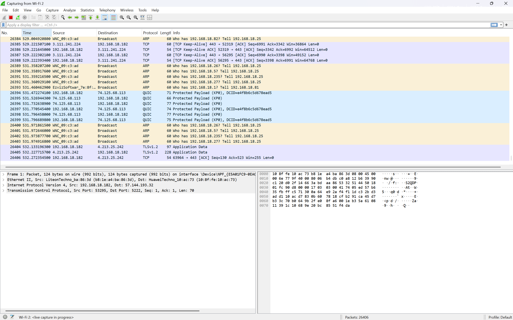

##Laporan Prakktikum Jaringan Komputer Modul 3 Terkait HTTP
- Nama          : I Made Sudiarte
- NIM           : 103072400044
- Kelas         : IF-04-05

#Tujuan Praktikum
- Mahasiswa dapat menginvestigasi cara kerja protokol HTTP menggunakan Wireshark.

#Percobaan

#Melakukan Capturing Wifi 2 Pada Wireshark

Tampilan Awal

