## Laporan Prakktikum Jaringan Komputer Modul 3 Terkait HTTP
- Nama          : I Made Sudiarte
- NIM           : 103072400044
- Kelas         : IF-04-05

# Tujuan Praktikum
- Mahasiswa dapat menginvestigasi cara kerja protokol HTTP menggunakan Wireshark.

# Percobaan

# Melakukan Capturing Wifi 2 Pada Wireshark

Tampilan Awal

1 Langkah awal yang kita lakukan adalah filter tampilan capturing dengan mengetik "http" pada kolom filter lalu enter

tampilanya akan seperti gambar di bawah 

2 Selanjutnya Kita membuka tautan berikut : http://gaia.cs.umass.edu/wireshark-labs/HTTP-wireshark-file1.html pada browser dan pastikan linknya http bukan https, jika sudah maka tampilanya akan seperti gambar di bawah 

3. Masuk ke Wiresharknya, cek lalu lintas capturing yang sudah difilter tadi, maka akan terdapat 2 lalu linta jaringan dengan protokol http, karena kita sudah membuka link di atas.

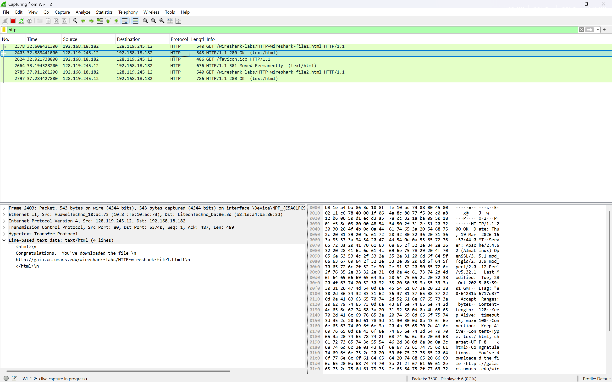

- penjelasan : Terdapat Packet keluar dari laptop (IP lokal 192.168.18.182) menuju server (IP 128.119.245.12) dengan protokol HTTP. Contohnya: GET request untuk file /wireshark-labs/HTTP-wireshark-file1.html. Packet masuk, ini balasan dari server ke laptop. Contohnya: HTTP/1.1 304 Not Modified yang berarti file sudah ada di cache, jadi server tidak mengirim ulang isi file. di bagian bawah pada gambar kita dapat melihat pesaan yang terdapat pada website yang kita buka

4. Selanjutnya buka link berikut : http://gaia.cs.umass.edu/wireshark-labs/HTTP-wireshark-file2.html, pastikan http bukan https

website akan menampilkan seperti berikut 

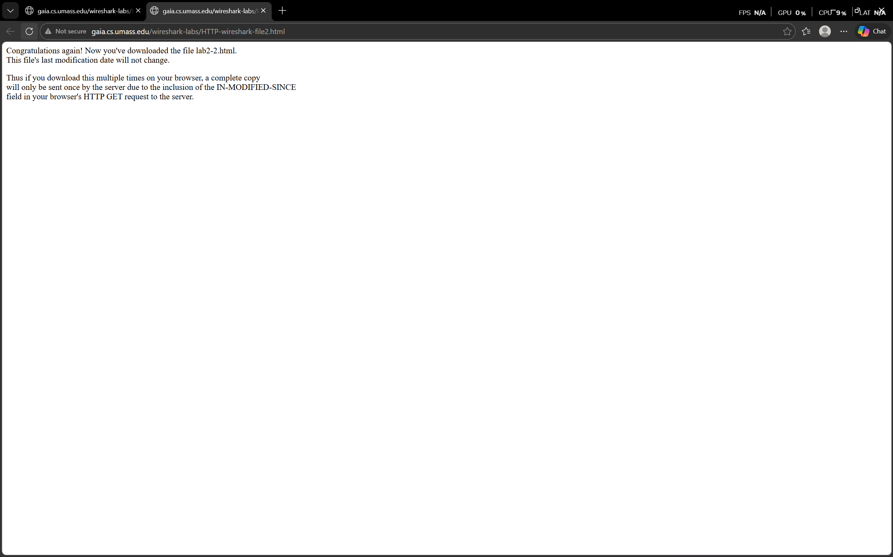

5. selanjutnya balik lagi ke wireshark

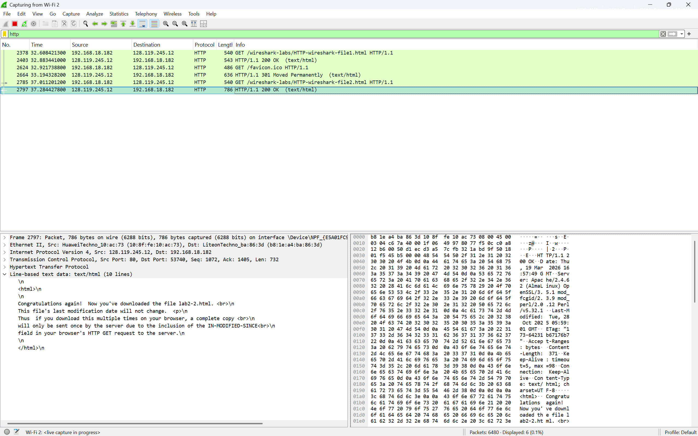

* terdapat 2 paket baru, paket yang keluar dan respon dari website/paket yang masuk.

6. salin buka lagi link http://gaia.cs.umass.edu/wireshark-labs/HTTP-wireshark-file2.html untuk kedua kalinya lalu refresh
7. balik lagi ke wireshark, maka akan terdapat 2 paket lagi, akan tetapi ada beberapa perbedaan dari responnya.

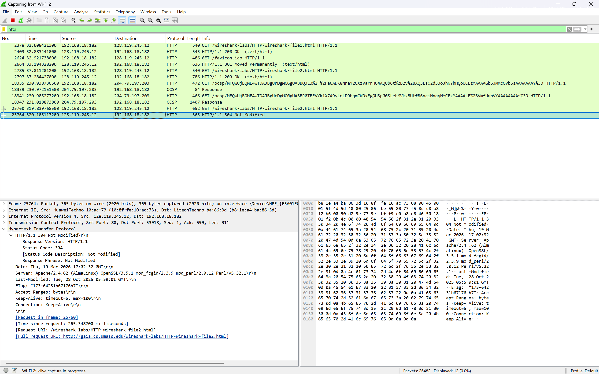
* terlihat info dari paket yang masuk tertulis - HTTP/1.1 304 Not Modified yang seharusnya - HTTP/1.1 200 OK (text/html), ini terjadi karena sebelumnya kita sudah pernah mengakses website tersebut sehingga data cache tersimpan pada browser kita sehingga server tidak perlu mengirim ulang isi filenya.

8. Lanjut buka link berikut : http://gaia.cs.umass.edu/wireshark-labs/HTTP-wireshark-file3.html, pastikan http, buka https
Tampilannya akan seperti berikut :

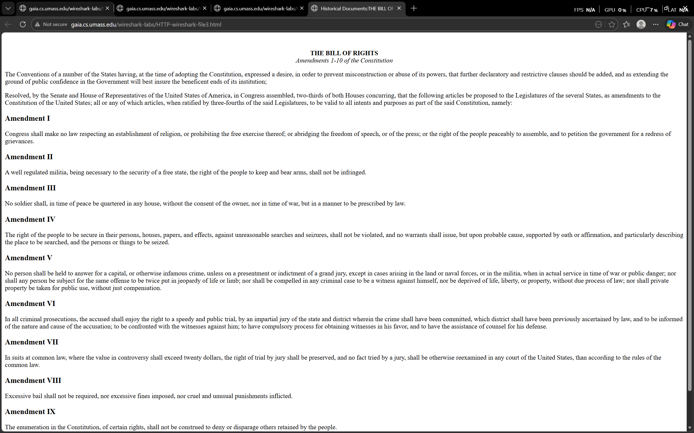

9. Balik lagi kewireshark buat cek
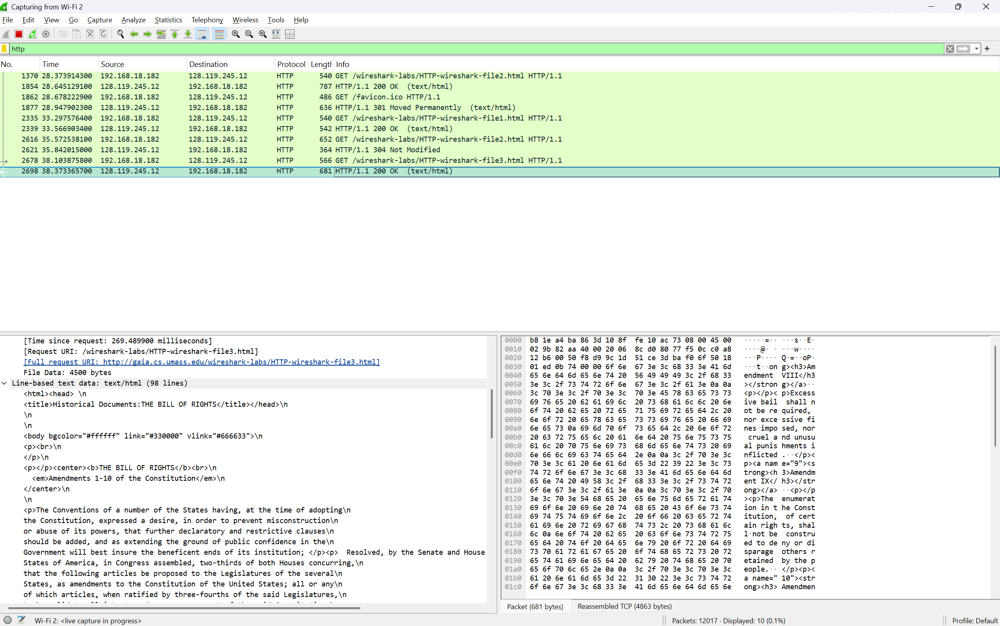

- penjelasan : Dalam kasus HTTP GET, entitas dalam
respons adalah seluruh file HTML yang diminta. Dalam kasus ini, file HTML agak panjang, dan dengan
ukuran 4500 byte terlalu besar untuk di muat dalam satu paket TCP. Di Wireshark versi terbaru,
Wireshark menunjukkan setiap segmen TCP sebagai paket terpisah, dan fakta bahwa respons HTTP
tunggal terfragmentasi (terbagi) menjadi beberapa paket TCP ditunjukkan oleh “TCP segment of a
reassembled PDU” (segmen TCP dari PDU yang dipasang kembali), di kolom Info pada Wireshark . (modul JARKOM IF Genap 2526 halamn 22)

10. Lanjut buka link berikut : http://gaia.cs.umass.edu/wireshark-labs/HTTP-wireshark-file4.html pastikan http, bukan https

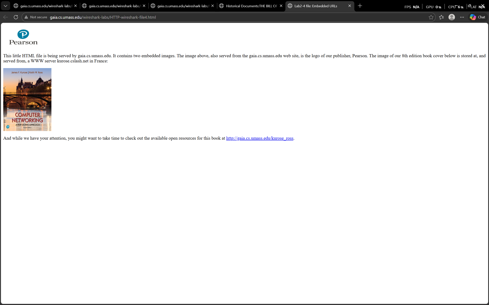
*di dalam link tersebut terdapat beberapa teks dan beberapa gambar

11. Kembali Kewireshark lagi, untuk cek

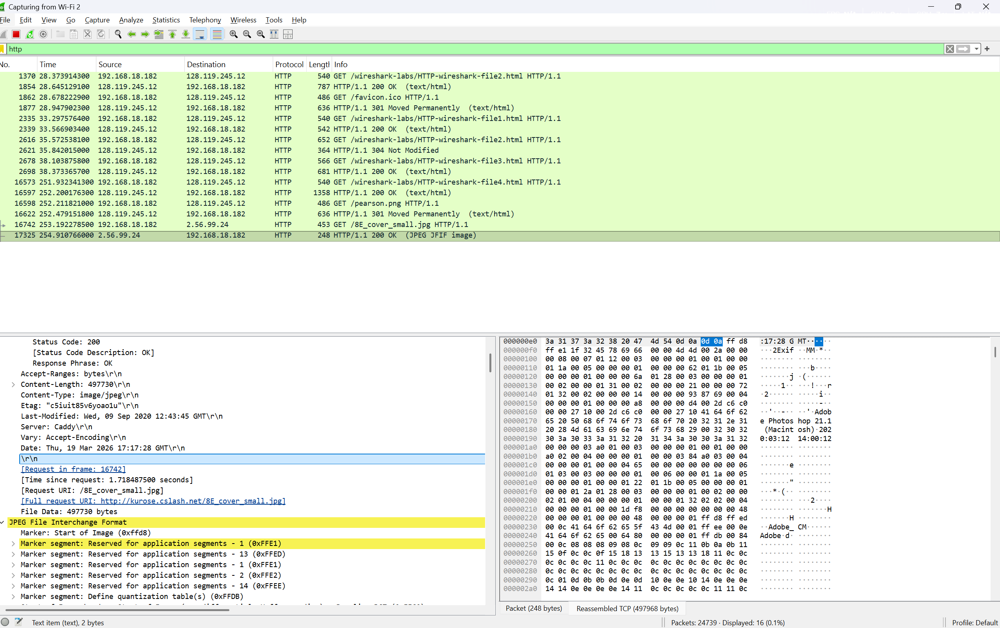
*terdapat 2 paket baru, paket yang keluar dan respon dari website/paket yang masuk. namun bedanya di sini terdapat keterangan gambar dan bukan teks lagi  pada HTTP/1.1 200 OK (JPEG JFIF image), ini terjadi karena terdapat gambar pada website tersebut.

- penjelasan : Setelah membuka link tersebut browser seharusnya menampilkan file HTML pendek dengan dua gambar. Kedua gambar ini
direferensikan dalam file HTML dasar. Artinya, gambar itu sendiri tidak terdapat dalam HTML;
alih-alih hanya terdapat URL kedua gambar pada file HTML tersebut. Browser Anda harus
mengambil logo ini dari URL situs web yang disematkan pada file HTML. Logo penerbit kita
diambil dari situs web gaia.cs.umass.edu. (modul JARKOM IF Genap 2526 halaman 22).

12. Lanjut buka link berikut : http://gaia.cs.umass.edu/wireshark-labs/protected_pages/HTTP-wireshark-file5.html pastikan http, bukan https

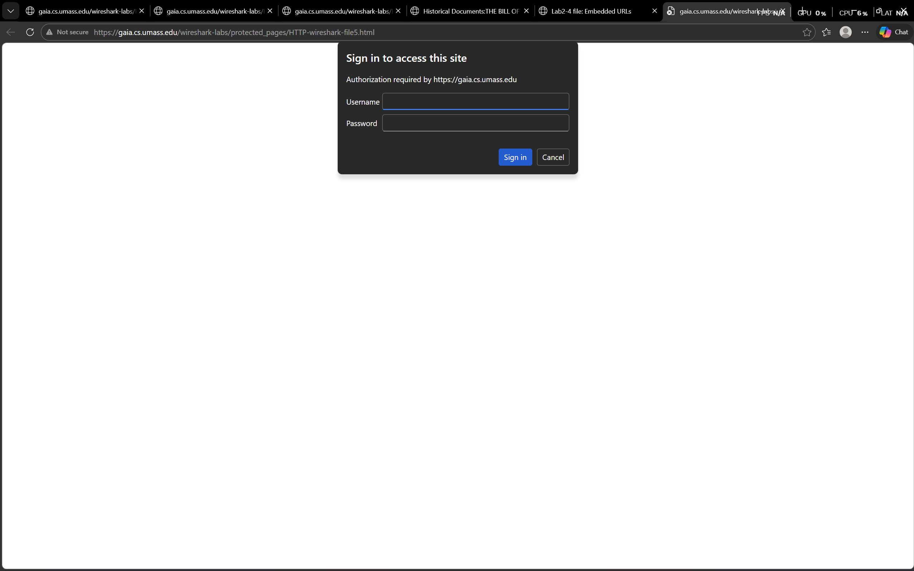
*setelah berhasil membuka link tersebut, kita akan dimintai username dan password. Ketik username dan password yang diminta
ke dalam kotak pop up (Username adalah "wireshark-students" (tanpa tanda kutip), dan password adalah "network" (tanpa tanda kutip)). jika salah memasukan username atau password, maka kita akan terus dimintai username dan password. jika berhasil maka akan menampilkan beberapa pesan berikut.

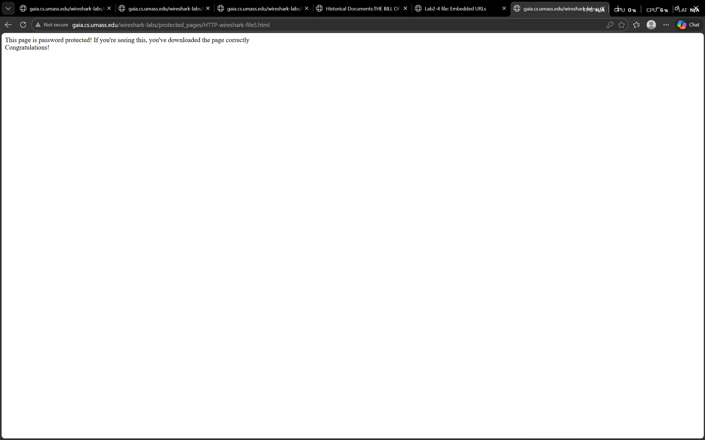

13. Terakhir buka wireshark lagi untuk mengecek

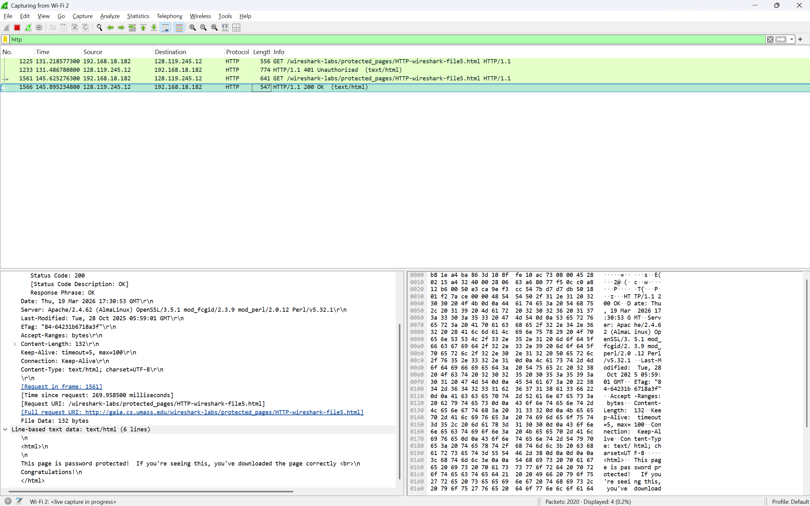
*Terdapat 2 paket yang masuk, yang pertama HTTP/1.1 401 Unauthorized (text/html) ini berarti website yang kita akses memiliki proteksi yang dimana harus memasukan username dan password untuk mengakses/membukanya. yang kedua itu HTTP/1.1 200 OK (text/html) yang berarti kita berhasil mengakses webtersebut.

# Cukup Sekian Laporan Praktikum Dari Saya, Kurang dan Lebihnya Saya Mohon Maaf. Saya Ucapkan Terima Kasih

## Lampiran
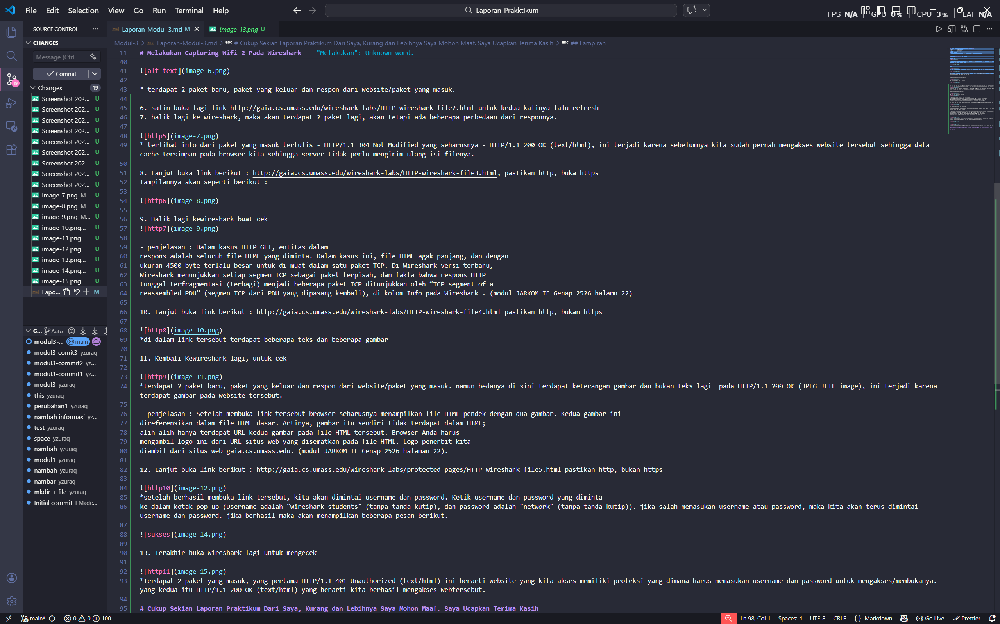

