# Modul 4 DNS
## Tujuan Praktikum 
1. Mahasiswa dapat menginvestigasi cara kerja DNS menggunakan Wireshark

## A. Pengantar
Sistem Nama Domain (DNS) adalah komponen protokol standar internet yang bertanggung jawab untuk mengubah nama domain yang mudah dipahami manusia menjadi alamat Internet Protocol (IP) yang digunakan komputer untuk mengidentifikasi satu sama lain di jaringan.

## B. Nslookup
nslookup memungkinkan host yang menjalankan perintah untuk
bertanya mengenai suatu server DNS dan mendapatkan informasi DNS dari server tersebut. Server
DNS yang ditanyakan dapat berupa server DNS root, server DNS domain tingkat atas, server DNS
otoritatif, atau server DNS perantara. Untuk menyelesaikan perintah ini, nslookup mengirimkan
permintaan DNS ke server DNS yang ditentukan host, menerima balasan DNS dari server DNS yang
sama, dan menampilkan hasilnya.
    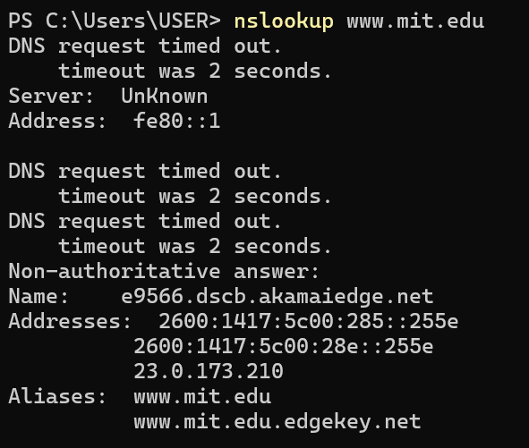
* perintah di atas digunakan untuk meminta alamat ip dari website yang dituju/www.mit.edu

## Lakukan beberapa hal berikut (dan amati hasilnya):
1. Jalankan nslookup untuk mendapatkan alamat IP dari server web di Asia. Berapa alamat IP server tersebut?

    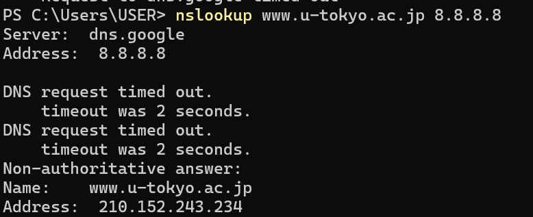
* dari hasil nslookpu untuk server pendidikan di jepang, didapat alamat ip 210.152.243.234

2. Jalankan nslookup agar dapat mengetahui server DNS otoritatif untuk universitas di Eropa.

    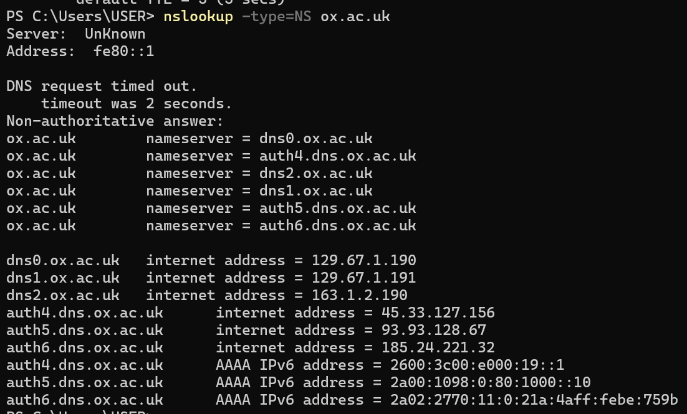
*dari hasil nslookup -type=NS ox.ac.uk (University of Oxford) terlihat ada 3 namaserver utama dan 3 authoritative server tambahan yang jika dijumlahkan jadi terdapat 6 dns.

3. Jalankan nslookup untuk mencari tahu informasi mengenai server email dari Yahoo! 
    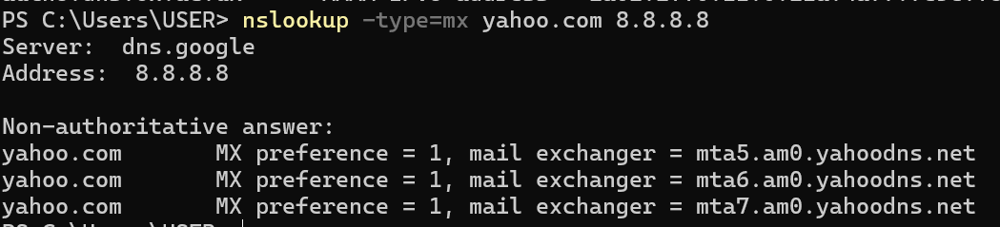

Mail melalui salah satu server yang didapatkan di pertanyaan nomor 2. Apa alamat IP-nya?
    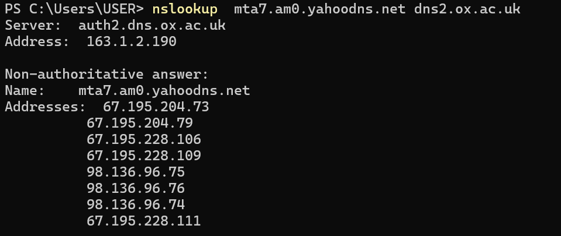
* dari hasil di atas kita mendapatkan beberapa ip, yakni : 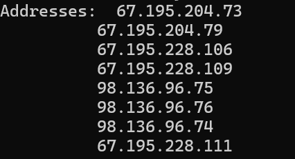

## C. Ipconfig
Ipconfig dapat digunakan untuk menampilkan informasi mengenai TCP/IP Anda saat ini, termasuk alamat IP Anda, alamat server DNS, jenis adaptor, dan sebagainya. Sebagai contoh, Anda dapat memperoleh semua informasi tentang host Anda hanya dengan memasukkan: ipconfig \all
    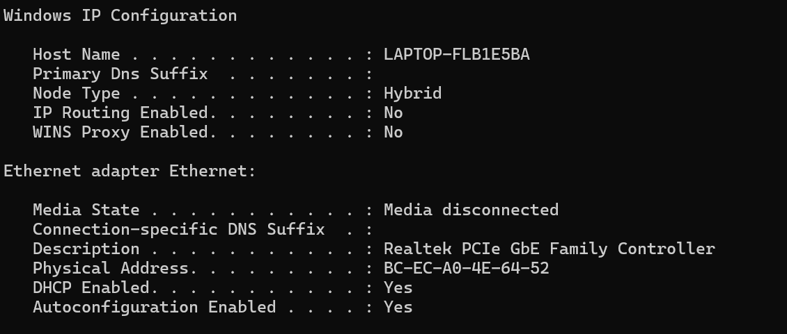

Ipconfig juga sangat berguna untuk mengelola informasi DNS yang tersimpan dalam host kita. Untuk melihat record yang telah disimpan, ketik perintah berikut : nslookup /displaydns dengan posisi terminal berada pada directory C 
    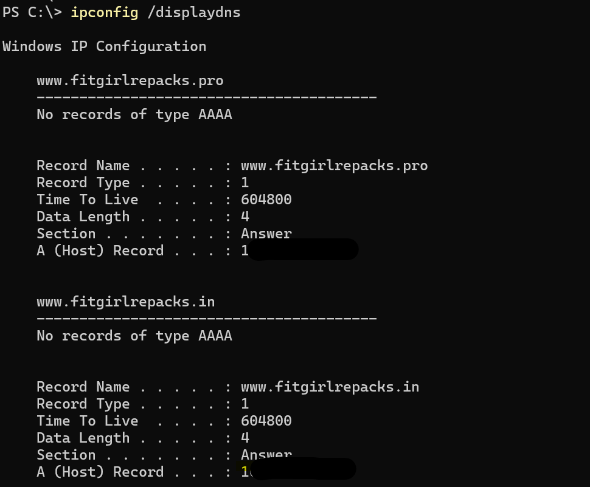
Hasil yang didapatkan akan menampilkan record dan sisa Time To Live (TTL) dalam satuan detik.
Untuk menghapus cacatan, masukkan:
    ipconfig /flushdns
Mengosongkan catatan DNS berarti menghapus semua record dan memuat ulang record dari file
host.

## Tracing DNS dengan Wireshark

Download file pada link berikut :  (http://gaia.cs.umass.edu/wiresharklabs/wireshark-traces.zip)

Selanjutnya, menjawab beberapa pertanyaan : 
Sebelum itu, buka link berikut : https://www.ietf.org/
buka wireshark lalu masukkan "ip.addr == <your_IP_address>" ke dalam filter. Bagian <your_IP_address> diisi dengan alamat IP Anda yang didapatkan melalui ipconfig. Filter ini akan menghapus semua paket yang tidak berasal atau ditujukan ke host Anda. sedikit tambahan filternya, yakni dns dan kata yang ada ietf
    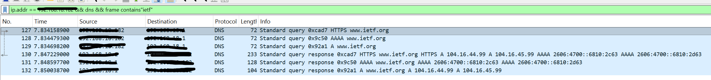

1. Cari pesan permintaan DNS dan balasannya. Apakah pesan tersebut dikirimkan melalui UDP atau TCP?
    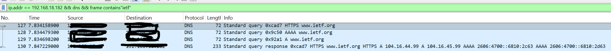 gambar di samping menunjukan permintaan dns dan balasannya (yang ditujukan oleh tanda panah masuk dan keluar)
    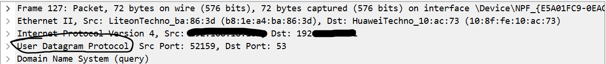 terlihat pesantersebut dikirim melalui UDP (User Datagram Protocol)

2. Apa port tujuan pada pesan permintaan DNS? Apa port sumber pada pesan balasannya?
    jawab : pada gambar  terlihat browser melakukan permintaan dari port 52159 ke port 53
    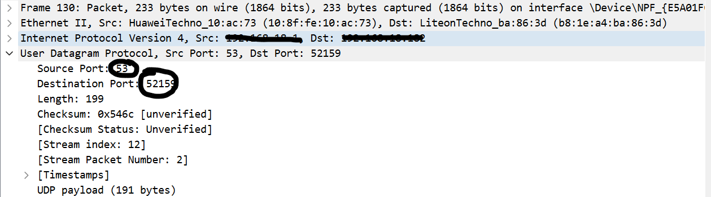 dan setelah itu permintaan akan dikembalikan oleh port 53 ke port 52159

3. Pada pesan permintaan DNS, apa alamat IP tujuannya? 
    jawab : terlihat pada gambar soal no 1, alamt ip tujuannya adalah 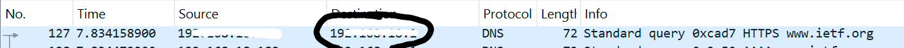 
    Apa alamat IP server DNS lokal anda (gunakan ipconfig untuk mencari tahu)? Apakah kedua alamat IP tersebut sama?
    jawab : sama 

4. Periksa pesan permintaan DNS. Apa “jenis” atau ”type” dari pesan tersebut? 
    jawab : 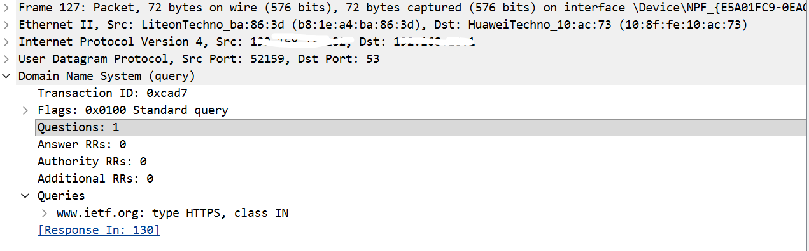 dari gambar di samping terlihat type dari permintaan DNS adalah HTTPS, sedangkan type dari respon dari permintaannya  adalah 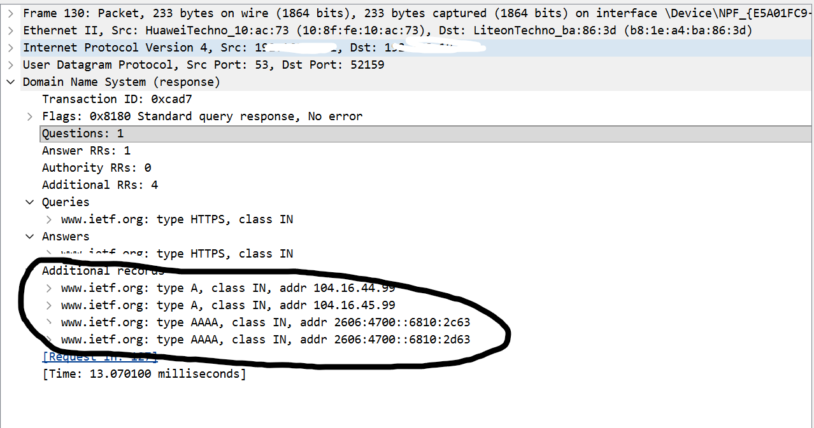 
    Apakah pesan permintaan tersebut mengandung ”jawaban” atau ”answers”?
    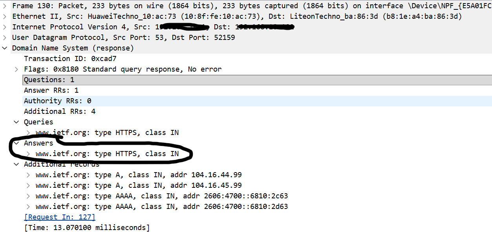 dari gambar di samping terlihat jawaban dari permintaan browser dengan port 52159 ke port 53 di mana itu merupakan jawaban langsung untuk query

5. Periksa pesan balasan DNS. Berapa banyak ”jawaban” atau ”answers” yang terdapat di dalamnya? Apa saja isi yang terkandung dalam setiap jawaban tersebut?
    jawab : dari gambar  terlihat hanya ada satu jawaban dengan isi dns record yang diminta

6. Perhatikan paket TCP SYN yang selanjutnya dikirimkan oleh host Anda. Apakah alamat IP pada paket tersebut sesuai dengan alamat IP yang tertera pada pesan balasan DNS?
jawab : -
7. Halaman web yang sebelumnya anda akses (http://www.ietf.org) memuat beberapa gambar. Apakah host Anda perlu mengirimkan pesan permintaan DNS baru setiap kali ingin mengakses suatu gambar?
    jawab : tidak, karena konten yang diperlukan berada pada domain yang sama 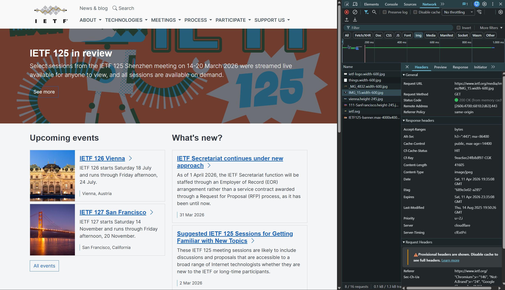

next jika kalian tidak dapat melakukan penangkapan paket melalui Wireshark, gunakan file dns-ethereal-trace-2 pada http://gaia.cs.umass.edu/wiresharklabs/wireshark-traces.zip
- Lakukan perintah nslookup untuk www.mit.edu
    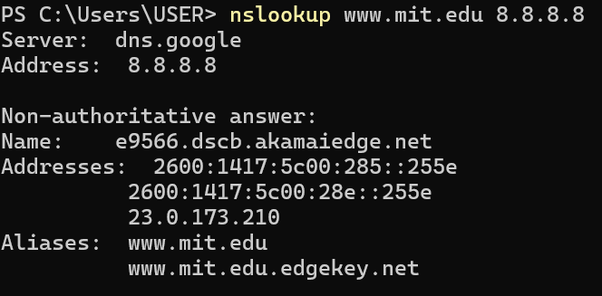 saya tambahkan 8.8.8.8/ip google soalnya jika pake wifi kost selalu DNS request timed out

## Soal
1. Apa port tujuan pada pesan permintaan DNS? Apa port sumber pada pesan balasan DNS?
    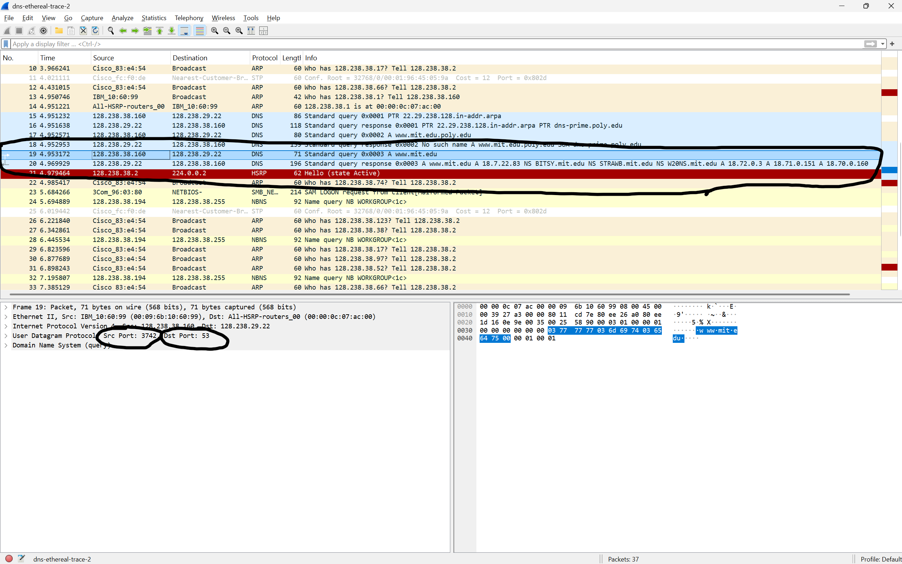 dari gambar di samping terlihat port tujuannya adalah 53 dan port sumbernya adalah 3742

2. Ke alamat IP manakah pesan permintaan DNS dikirimkan? Apakah alamat IP tersebut merupakan default alamat IP server DNS lokal Anda?
    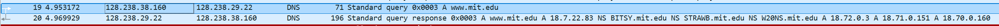 dari gambar di samping terlihat alamat ip pesan permintaan dns dikirimkan ke 128.238.29.22 dan ini bukan merupakan default alamat ip server DNS lokal saya. (saya pake capturing file dns-ethernet-trace-2)

3. Periksa pesan permintaan DNS. Apa ”jenis” atau ”type” dari pesan tersebut? Apakah pesan tersebut mengandung ”jawaban” atau ”answers”?
    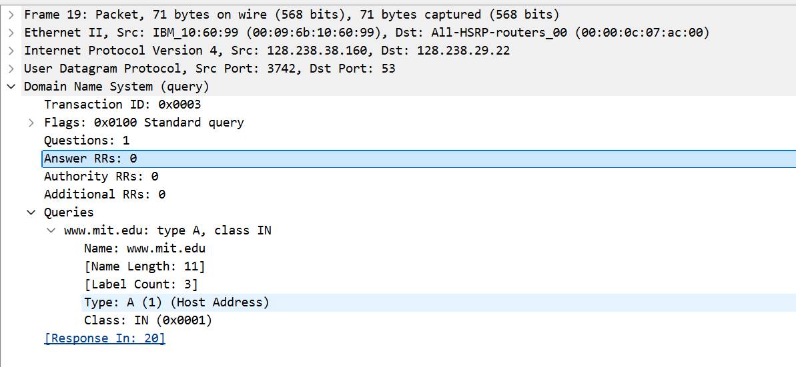 dari gambar di samping terlihat type dari pesan tersebut adalah queries, dengan tidak ada jawaban / jawaban langsung query

4. Periksa pesan balasan DNS. Berapa banyak ”jawaban” atau “answers” yang terdapat di dalamnya. Apa saja isi yang terkandung dalam setiap jawaban tersebut?
    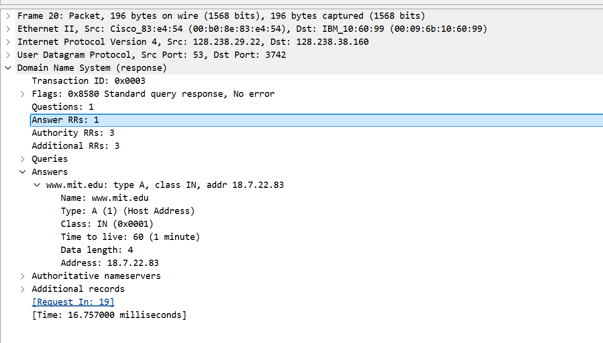 dari gambar di samping terlihat hanya ada 1 jawaban yang berisi record dari mit.edu

## Sekarang, ulangi percobaan sebelumnya, namun gunakan perintah:
nslookup –type=NS mit.edu
    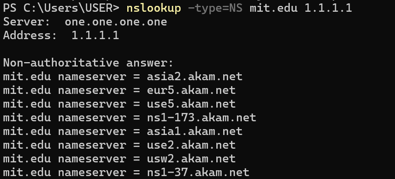

## Soal 
1. Ke alamat IP manakah pesan permintaan DNS dikirimkan? Apakah alamat IP tersebut merupakan default alamat IP server DNS lokal Anda?
    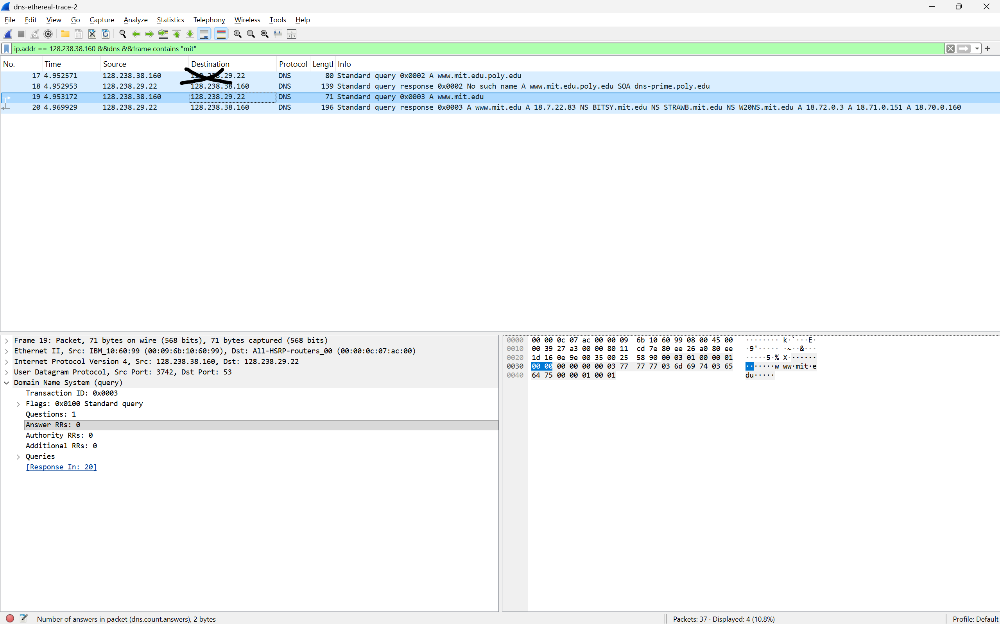 dari gambar di samping  terlihat pesan permintaan DNS dikirim ke alamat ip 128.238.29.22 dengan port 53, dan ini bukan merupakan alamat ip dafault server dns lokal saya (saya pake file capturing bernama dns-ethernet-trace-2)

2. Periksa pesan permintaan DNS. Apa ”jenis” atau ”type” dari pesan tersebut? Apakah pesan tersebut mengandung ”jawaban” atau ”answers”?
    jawab : sama seperti sebelumnya  dari gambar di samping terlihat type dari pesan tersebut adalah queries, dengan tidak ada jawaban / jawaban langsung query

3. Periksa pesan balasan DNS. Apa nama server MIT yang diberikan oleh pesan balasan? Apakah pesan balasan ini juga memberikan alamat IP untuk server MIT tersebut?
    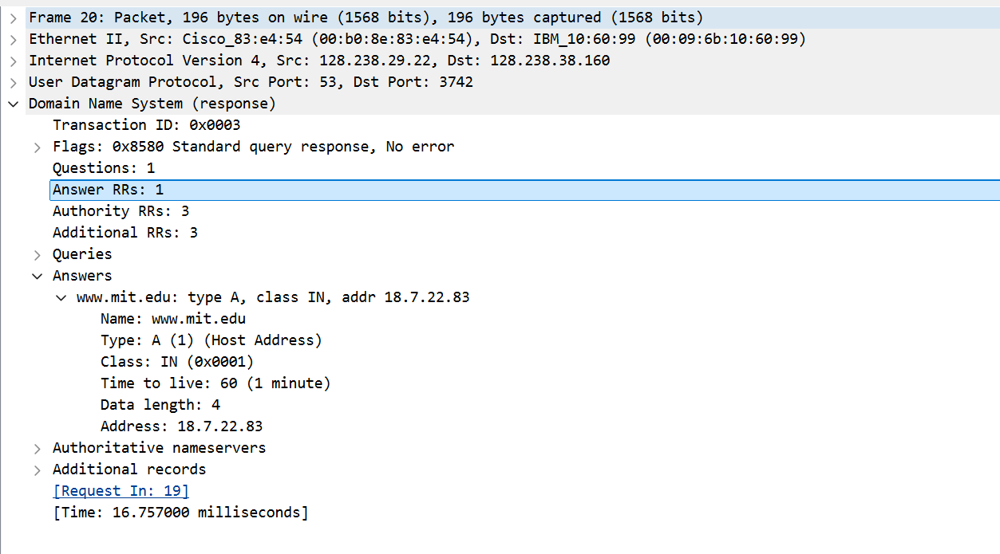
    jawab : nama server MIT yang diberikan adalah www.mit.edu, dengan ip 18.7.22.83

## Sekarang, ulangi percobaan sebelumnya, namun gunakan perintah:
nslookup www.aiit.or.kr bitsy.mit.edu
   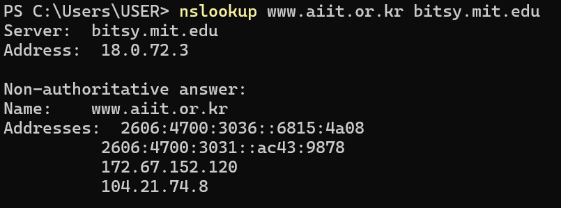 

## Soal
1. Ke alamat IP manakah pesan permintaan DNS dikirimkan? Apakah alamat IP tersebut merupakan default alamat IP server DNS lokal Anda?
    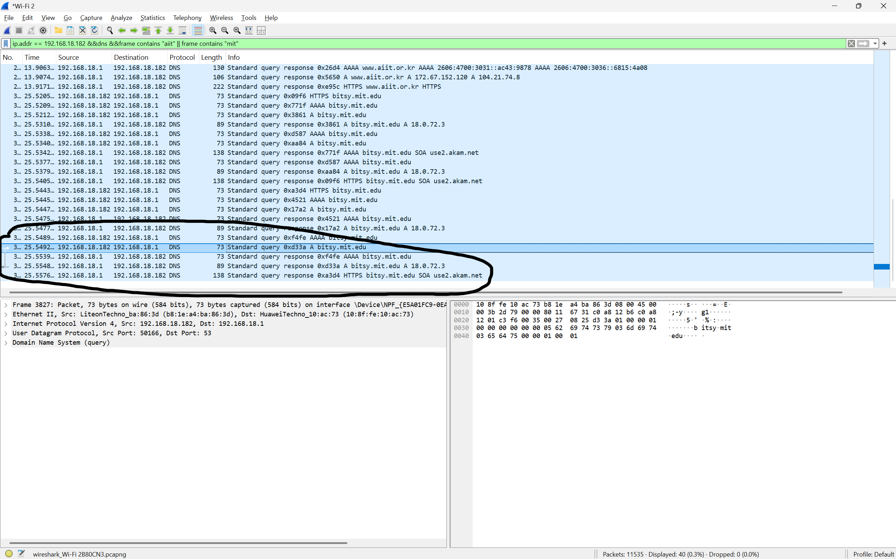 dari gambar di samping terlihat pesan permintaan dikirim ke ip 192.168.18.1 dan itu merupakan default alamat ip server dns lokal saya

2. Periksa pesan permintaan DNS. Apa ”jenis” atau ”type” dari pesan tersebut? Apakah pesan tersebut mengandung ”jawaban” atau ”answers”?
    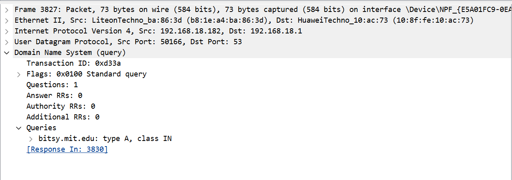 pesan dns tersebut bertype queries dengan tidak ada jawaban

3. Periksa pesan balasan DNS. Berapa banyak ”jawaban” atau “answers” yang terdapat di dalamnya. Apa saja isi yang terkandung dalam setiap jawaban tersebut?
    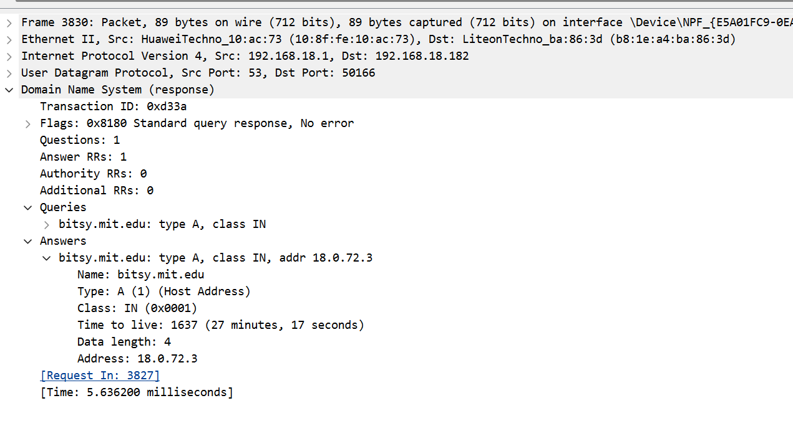 dari gambar di samping terlihat hanya ada satu jawaban yang dimana jawabannya berisi record dari bitsy.mit.edu

# Lampiran
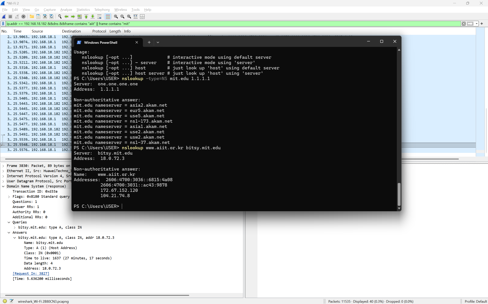