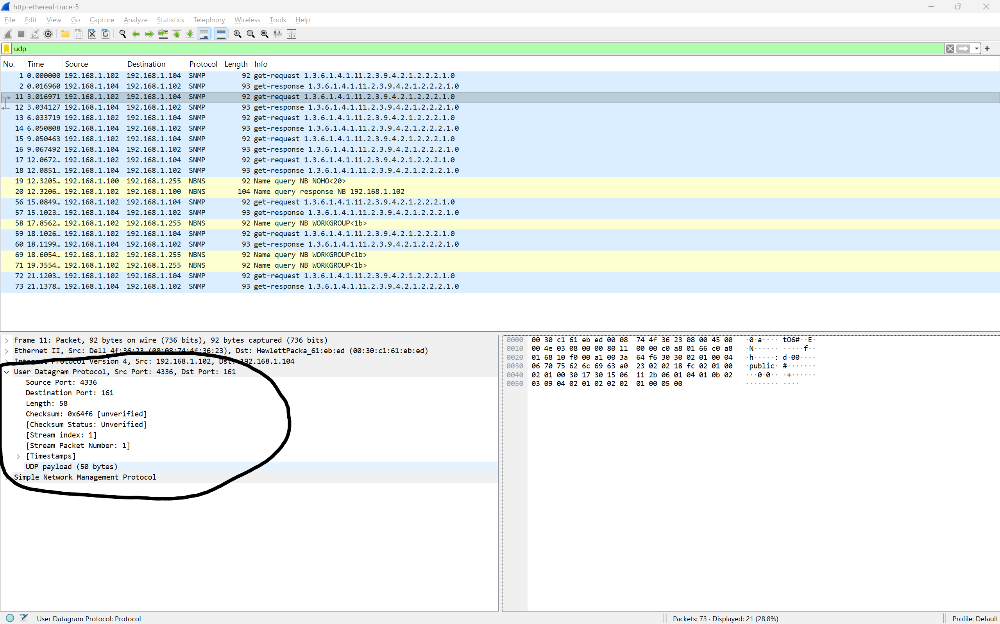
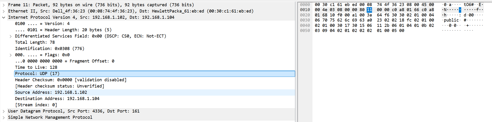
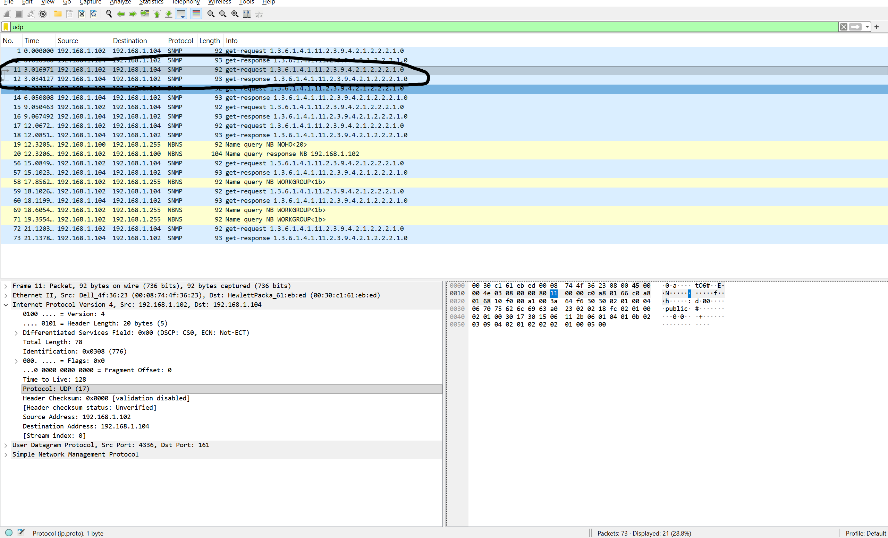
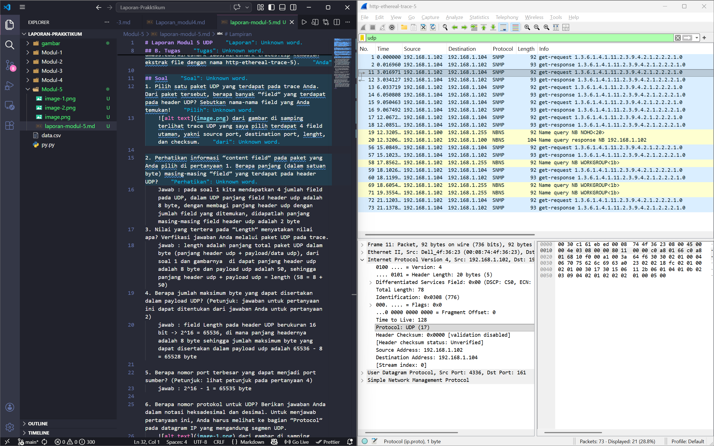

# Laporan Modul 5 UDP
## Tujuan Praktikum
1. Mahasiswa dapat menginvestigasi cara kerja protokol UDP menggunakan Wireshark

## A. Pengantar
UDP adalah singkatan dari User Datagram Protocol. UDP adalah protokol transport yang digunakan dalam komunikasi data melalui jaringan komputer terutama pada transmisi data yang sensitif terhadap waktu seperti pemutaran video dan pencarian DNS. Protokol UDP memungkinkan pengiriman data yang sangat cepat namun kekurangan nya adalah seringkali terjadi paket hilang saat transit dan menumbulkan serangan DDoS. (source :http://it.telkomuniversity.ac.id/udp-adalah/)

## B. Tugas
Anda dapat mengunduh file berisi trace penangkapan paket UDP yang telah disediakan (buka link http://gaia.cs.umass.edu/wireshark-labs/wireshark-traces.zip kemudian ekstrak file dengan nama http-ethereal-trace-5).

## Soal
1. Pilih satu paket UDP yang terdapat pada trace Anda. Dari paket tersebut, berapa banyak “field” yang terdapat pada header UDP? Sebutkan nama-nama field yang Anda temukan!
     dari gambar di samping terlihat trace UDP yang saya pilih terdapat 4 field utaman, yakni source port, destination port, lenght, dan checksum.

2. Perhatikan informasi “content field” pada paket yang Anda pilih di pertanyaan 1. Berapa panjang (dalam satuan byte) masing-masing “field” yang terdapat pada header UDP?
    Jawab : pada soal 1 kita mendapatkan 4 jumlah field pada UDP, dalam UDP panjang field header udp adalah 8 byte, dengan membagi panjang header udp dengan jumlah field yang ditemukan, didapatlah panjang masing-masing field header udp adalah 2 byte 
3. Nilai yang tertera pada ”Length” menyatakan nilai apa? Verfikasi jawaban Anda melalui paket UDP pada trace.
    jawab : length adalah panjang total paket UDP dalam byte (panjang header udp + payload/data udp), dari soal 1 dan gambarnya  di dapat panjang header udp adalah 8 byte dan payload udp adalah 50, sehingga panjang header udp + payload udp = length (58 = 8 + 50)
4. Berapa jumlah maksimum byte yang dapat disertakan dalam payload UDP? (Petunjuk: jawaban untuk pertanyaan ini dapat ditentukan dari jawaban Anda untuk pertanyaan 2)
    jawab : field Length pada header UDP berukuran 16 bit -> 2^16 = 65536, di mana panjang headernya adalah 8 byte sehingga jumlah maksimum byte yang dapat disertakan dalam payload udp adalah 65536 - 8 = 65528 byte

5. Berapa nomor port terbesar yang dapat menjadi port sumber? (Petunjuk: lihat petunjuk pada pertanyaan 4)
    jawab : 2^16 - 1 = 65535 byte

6. Berapa nomor protokol untuk UDP? Berikan jawaban Anda dalam notasi heksadesimal dan desimal. Untuk menjawab pertanyaan ini, Anda harus melihat ke bagian ”Protocol” pada datagram IP yang mengandung segmen UDP.
     dari gambar di samping terlihat nomor protokol untuk udp adalah 17 dalam notasi desimal, sedangkan hexa kita bisa melihatnya pada bagian kanan, terlihat ada angka 11/0x11 ini adalah notasi protokol udp dalam bentuk hexa.

7. Periksa pasangan paket UDP di mana host Anda mengirimkan paket UDP pertama dan paket UDP kedua merupakan balasan dari paket UDP yang pertama. (Petunjuk: agar paket kedua merupakan balasan dari paket pertama, pengirim paket pertama harus menjadi tujuan dari paket kedua). Jelaskan hubungan antara nomor port pada kedua paket tersebut!
     dari gambar disamping terlihat ada tanda panah sebagai petunjuk permintaan yang dikirim dan diterima, panah ke kanan merupakan petunjuk bahwa ada permintaan dari lokal dns (192.168.1.102) ke ip tujuan (192.168.1.104), sedangkan panah ke kiri merupakan respon dari ip tujuan (192.168.1.104) dan dikirim ke dns ip lokal (192.168.1.102).

# Lampiran 
