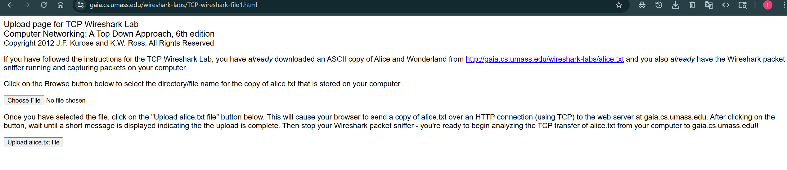
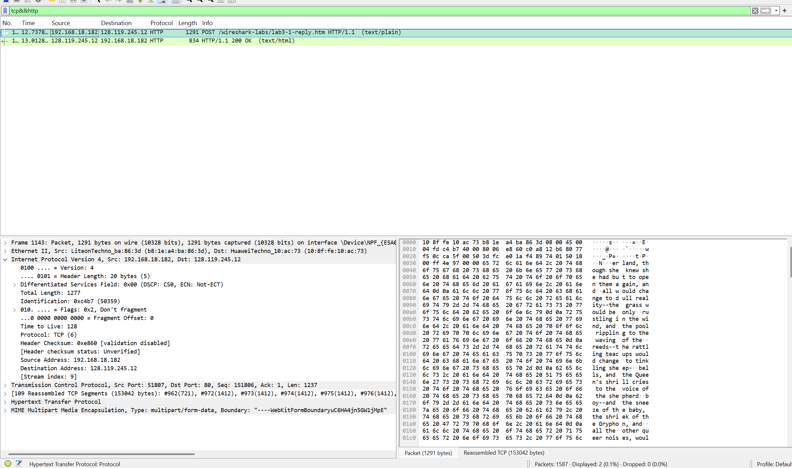

# Laporan Praktikum Modul 6 TCP

## Tujuan Praktikum
1. Mahasiswa dapat menginvestigasi cara kerja protokol TCP menggunakan Wireshark

## A. Pengantar
Transmission Control Protocol (TCP) adalah salah satu protokol jaringan yang paling umum digunakan untuk mengontrol pengiriman data antar komputer di dalam jaringan. TCP beroperasi di lapisan transport dalam model referensi jaringan OSI (Open Systems Interconnection). (source : https://www.exabytes.co.id/blog/transmission-control-protocol/#Pengertian-Transmission-Control-Protocol-TCP)

## B. Menangkap Tansfer TCP dalam Jumlah Besar dari Komputer Pribadi ke Remote Server 
Lakukan beberapa hal berikut:
- Jalankan browser web Anda. Buka http://gaia.cs.umass.edu/wireshark-labs/alice.txt dan
unduh salinan ASCII dari naskah Alice in Wonderland. Simpan file tersebut di komputer
Anda.
- Selanjutnya buka http://gaia.cs.umass.edu/wireshark-labs/TCP-wireshark-file1.html .
- Anda akan melihat tampilan layar seperti gambar di bawah:
    
- Gunakan tombol Browse untuk memasukkan nama file (nama path lengkap) dari file Alice in Wonderland yang terletak di komputer Anda. Jangan dulu menekan tombol “Upload alice.txt file”-
- Sekarang, jalankan Wireshark dan mulai penangkapan paket
- Kembali ke browser Anda, tekan tombol “Upload file alice.txt” untuk mengunggah file ke server gaia.cs.umass.edu. Setelah file diunggah, pesan berisi ucapan selamat akan ditampilkan di browser Anda.
- Hentikan penangkapan paket pada Wireshark. Jendela Wireshark Anda akan terlihat seperti gambar di bawah.
    
- gambar di atas berarti file yang di unggah tadi berhasil

## C. Tampilan Awal pada Captured Trace
Jawablah pertanyaan-pertanyaan berikut dengan menganalisis paket yang tertangkap pada trace
tcp- ethereal-trace-1. gambar di [Klik untuk lihat gambar](image-2.png)
1. Berapa alamat IP dan nomor port TCP yang digunakan oleh komputer klien (sumber) untuk
mentransfer file ke gaia.cs.umass.edu? Cara paling mudah menjawab pertanyaan ini adalah
dengan memilih sebuah pesan HTTP dan meneliti detail paket TCP yang digunakan untuk
membawa pesan HTTP tersebut.
2. Apa alamat IP dari gaia.cs.umass.edu? Pada nomor port berapa ia mengirim dan menerima
segmen TCP untuk koneksi ini?