# Laporan Praktikum Modul 6 TCP

## Tujuan Praktikum
1. Mahasiswa dapat menginvestigasi cara kerja protokol TCP menggunakan Wireshark

## A. Pengantar
Transmission Control Protocol (TCP) adalah salah satu protokol jaringan yang paling umum digunakan untuk mengontrol pengiriman data antar komputer di dalam jaringan. TCP beroperasi di lapisan transport dalam model referensi jaringan OSI (Open Systems Interconnection). (source : https://www.exabytes.co.id/blog/transmission-control-protocol/#Pengertian-Transmission-Control-Protocol-TCP)

## B. Menangkap Tansfer TCP dalam Jumlah Besar dari Komputer Pribadi ke Remote Server 
Lakukan beberapa hal berikut:
- Jalankan browser web Anda. Buka http://gaia.cs.umass.edu/wireshark-labs/alice.txt dan
unduh salinan ASCII dari naskah Alice in Wonderland. Simpan file tersebut di komputer
Anda.
- Selanjutnya buka http://gaia.cs.umass.edu/wireshark-labs/TCP-wireshark-file1.html .
- Anda akan melihat tampilan layar seperti gambar di bawah:
    
- Gunakan tombol Browse untuk memasukkan nama file (nama path lengkap) dari file Alice in Wonderland yang terletak di komputer Anda. Jangan dulu menekan tombol “Upload alice.txt file”-
- Sekarang, jalankan Wireshark dan mulai penangkapan paket
- Kembali ke browser Anda, tekan tombol “Upload file alice.txt” untuk mengunggah file ke server gaia.cs.umass.edu. Setelah file diunggah, pesan berisi ucapan selamat akan ditampilkan di browser Anda.
- Hentikan penangkapan paket pada Wireshark. Jendela Wireshark Anda akan terlihat seperti gambar di bawah.
    
- gambar di atas berarti file yang di unggah tadi berhasil

## C. Tampilan Awal pada Captured Trace
Jawablah pertanyaan-pertanyaan berikut dengan menganalisis paket yang tertangkap pada trace
tcp- ethereal-trace-1. gambar di [Klik untuk lihat gambar](image-2.png)
1. Berapa alamat IP dan nomor port TCP yang digunakan oleh komputer klien (sumber) untuk mentransfer file ke gaia.cs.umass.edu? Cara paling mudah menjawab pertanyaan ini adalah dengan memilih sebuah pesan HTTP dan meneliti detail paket TCP yang digunakan untuk membawa pesan HTTP tersebut. 
Jawab : Ip = 192.168.18.182 dan Port = 51807, lebih detail terlihat pada gambar berikut.
    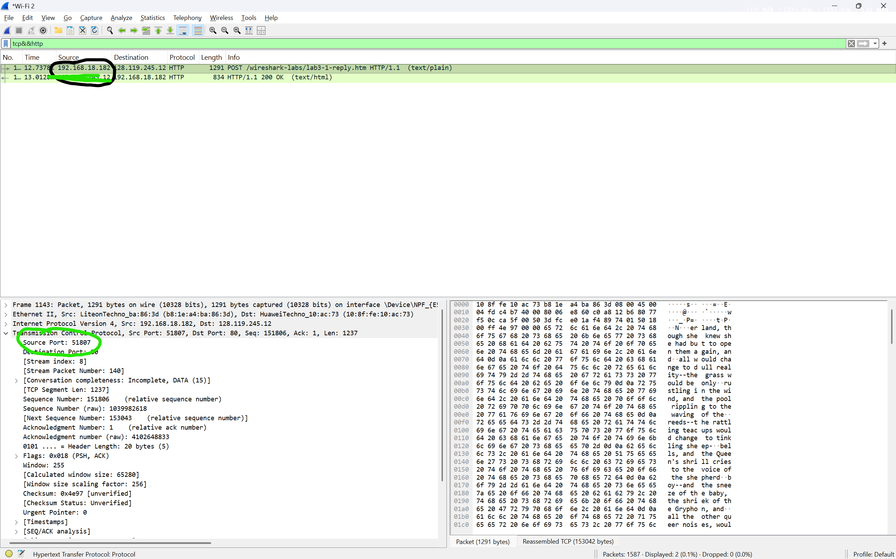
2. Apa alamat IP dari gaia.cs.umass.edu? Pada nomor port berapa ia mengirim dan menerima segmen TCP untuk koneksi ini? 
Jawab : Ip = 128.119.245.12 dan port = 80, lebih jelas lihat pada gambar di bawah ini.
    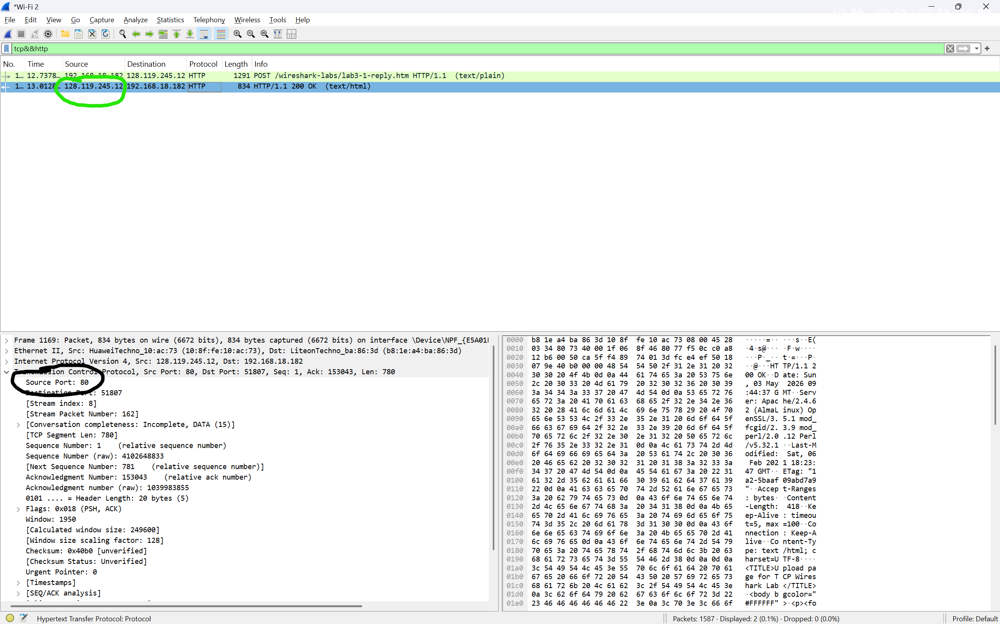
Jika Anda telah membuat trace Anda sendiri, jawab pertanyaan berikut:
3. Berapa alamat IP dan nomor port TCP yang digunakan oleh komputer klien Anda (sumber) untuk mentransfer ke gaia.cs.umass.edu?
Jawab : sama seperti jawaban no 1 [ini gambarnya](image-3.png)

## D. Dasar TCP
kita akan menggunakan trace paket yang telah Anda tangkap
(dan/atau jejak paket tcp-ethereal-trace-1 di http://gaia.cs.umass.edu/wireshark-labs/wiresharktraces.zip) untuk mempelajari sifat TCP.
    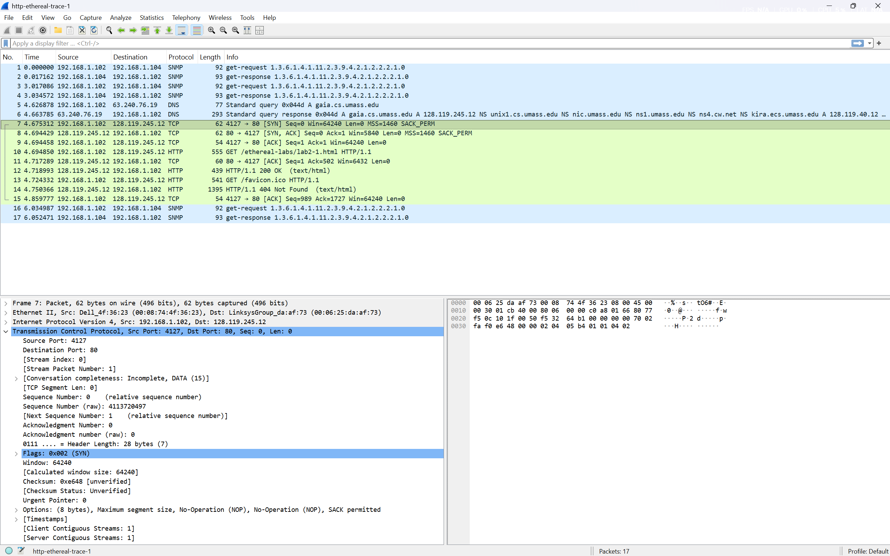
Jawablah beberapa pertanyaan berikut untuk segmen TCP:
1. Berapa nomor urut segmen TCP SYN yang digunakan untuk memulai sambungan TCP antara komputer klien dan gaia.cs.umass.edu? Apa yang dimiliki segmen tersebut sehingga teridentifikasi sebagai segmen SYN?
    Jawab : 0, 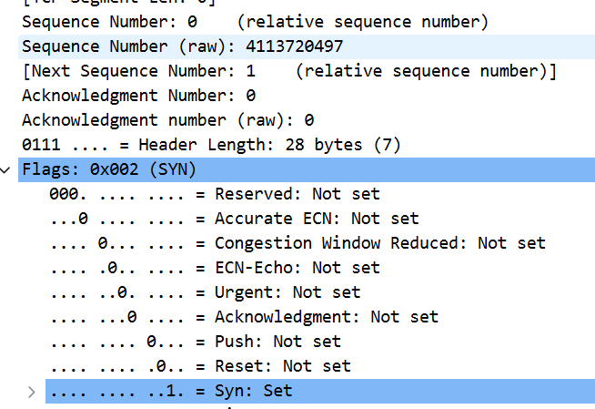 
    segmen tersebut memiliki flag syn = 1 

2. Berapa nomor urut segmen SYNACK yang dikirim oleh gaia.cs.umass.edu ke komputer klien sebagai balasan dari SYN? Berapa nilai dari field Acknowledgement pada segmen SYNACK? Bagaimana gaia.cs.umass.edu menentukan nilai tersebut? Apa yang dimiliki oleh segmen sehingga teridentifikasi sebagai segmen SYNACK?
    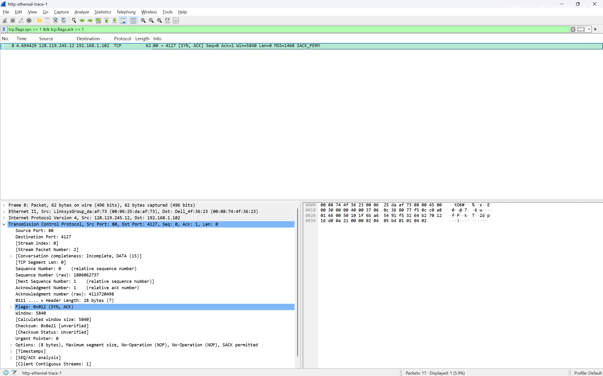
    jawab : 0 (relative sequence number), 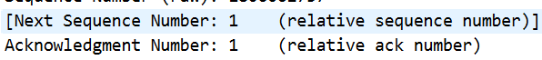 Nilai acknowledgment ditentukan dengan menambahkan 1 pada sequence number segmen SYN dari client, yang menunjukkan bahwa segmen tersebut merupakan balasan dari server dalam proses pembentukan koneksi TCP (three-way handshake).

3. Berapa nomor urut segmen TCP yang berisi perintah HTTP POST? Perhatikan bahwa untuk menemukan perintah POST, Anda harus menelusuri content field milik paket di bagian bawah jendela Wireshark, kemudian cari segmen yang berisi "POST" di bagian field DATAnya.
    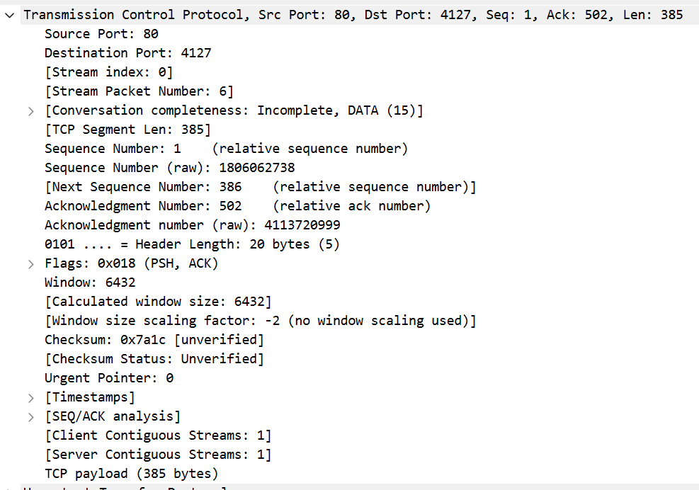
    Jawab = seq number = 1

4. Anggap segmen TCP yang berisi HTTP POST sebagai segmen pertama dalam koneksi TCP. Berapa nomor urut dari enam segmen pertama dalam TCP (termasuk segmen yang berisi HTTP POST)? Pada jam berapa setiap segmen dikirim? Kapan ACK untuk setiap segmen diterima? Dengan adanya perbedaan antara kapan setiap segmen TCP dikirim dan kapan acknowledgement-nya diterima, berapakah nilai RTT untuk keenam segmen tersebut? Berapa nilai EstimatedRTT setelah penerimaan setiap ACK? (Catatan: Wireshark memiliki fitur yang memungkinkan Anda untuk memplot RTT untuk setiap segmen TCP yang dikirim. Pilih segmen TCP yang dikirim dari klien ke server gaia.cs.umass.edu pada jendela "daftar paket yang ditangkap". Kemudian pilih: Statistics->TCP Stream Graph- >Round Trip Time Graph).
   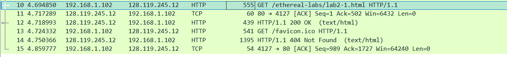
    jawab : waktu segmen 1 : 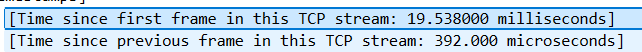
            waktu segmen 2 : 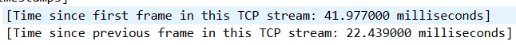
            waktu segmen 3 :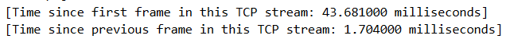
            waktu segemn 4 :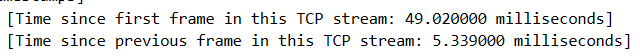
            waktu segemn 5 :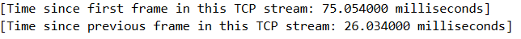
            waktu segemn 6 :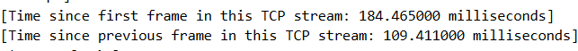
    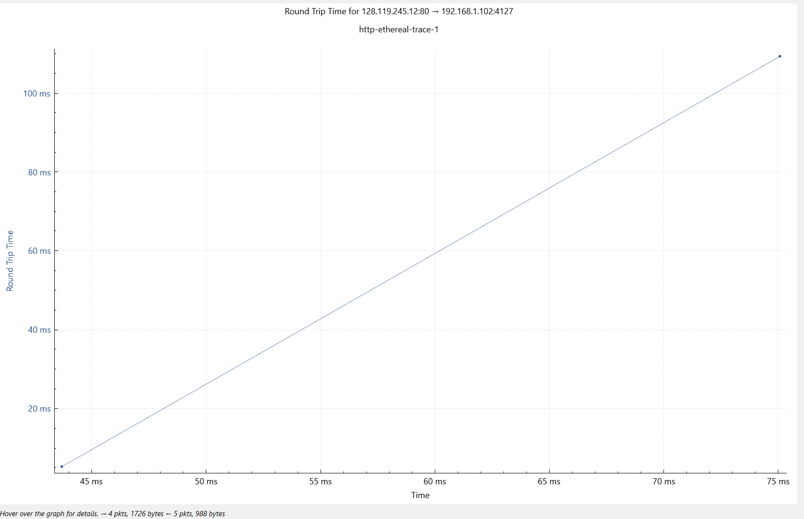

5. Berapa panjang setiap enam segmen TCP pertama?
    jawab : segmen 1 = 501
            segmen 2 = 0 
            segmen 3 = 385
            segmen 4 = 487 
            segmen 5 = 1341
            segmen 6 = 0
            
6. Berapa jumlah minimum ruang buffer tersedia yang disarankan kepada penerima dan diterima untuk seluruh trace? Apakah kurangnya ruang buffer penerima pernah menghambat pengiriman?
    Jawab : Pada sebagian besar trace standar, nilai minimum Calculated window size adalah 64240 bytes, serta Filter tcp.analysis.zero_window biasanya tidak menemukan paket apapun, yang berarti buffer penerima selalu cukup untuk menampung data yang masuk

7. Apakah ada segmen yang ditransmisikan ulang dalam file trace? Apa yang anda periksa (di dalam file trace) untuk menjawab pertanyaan ini?
    jawab : dari file http-ethereal-trace-1 tidak terdapat segmen yang ditransmisikan ulang, untuk mengetahui hal tersebut saya menggunakan filter tcp.analysis.retransmission

8. Berapa banyak data yang biasanya diakui oleh penerima dalam ACK? Dapatkah anda mengidentifikasi kasus-kasus di mana penerima melakukan ACK untuk setiap segmen yang diterima?
    Jawab : jika ACK Numbernya = 502, maka banyak data yang diakui oleh penerima adalah 501
    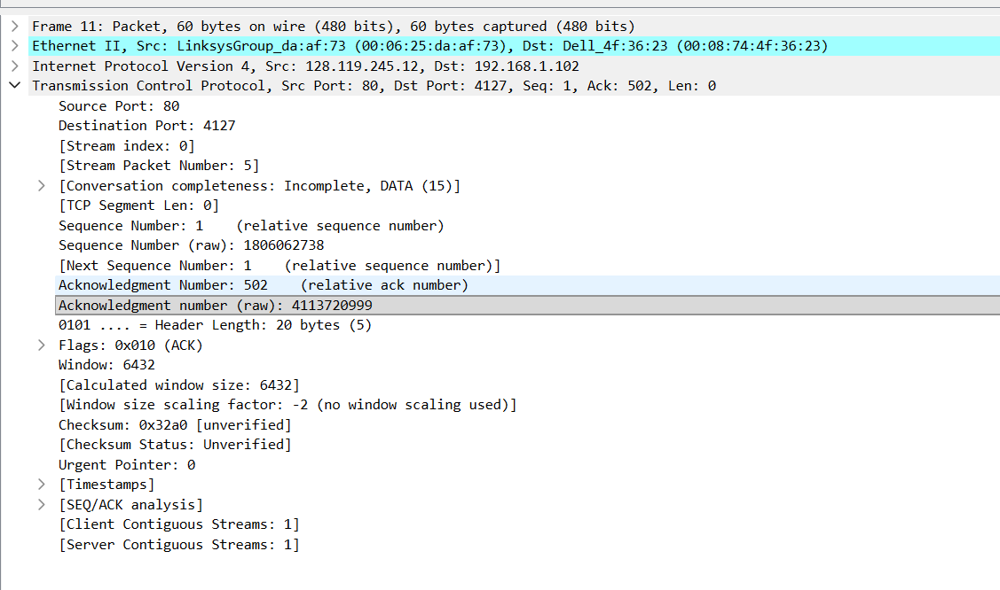
9. Berapa throughput (byte yang ditransfer per satuan waktu) untuk sambungan TCP? Jelaskan bagaimana Anda menghitung nilai ini.
    Jawab = Throughput (byte/s) = total_data (byte) / durasi (detik)
            contoh Throughput (byte/s) = 385 / 0,041977 = 9.171,689258403411 bytes/s
## E. Congestion Control pada TCP
Jawalah beberapa pertanyaan berikut menggunakan segmen TCP pada trace paket tcp-etherealtrace-1 di http://gaia.cs.umass.edu/wireshark-labs/wireshark-traces.zip .
1. Gunakan alat plotting Time-Sequence-Graph (Stevens) untuk melihat grafik nomor urut berbanding waktu dari segmen yang dikirim oleh klien ke server gaia.cs.umass.edu. Dapatkah Anda mengidentifikasi di mana fase “slow start” TCP dimulai dan berakhir, dan pada bagian mana algoritma ”congestion avoidance” mengambil alih? Berikan komentar tentang bagaimana data yang diukur berbeda dari perilaku ideal TCP yang telah kita pelajari.
    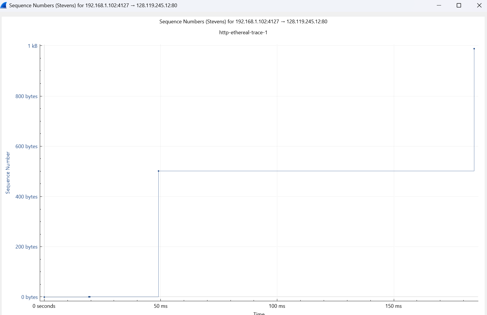
    dari gambar di atas, slow start dimulai pada o second hingga 50ms, dan dari 50 ms ke 190 ms, terlihat lengkungan tajam dari waktu 50ms dan 190ms itu adalah congestion avoidance

2. Jawablah kedua pertanyaan di atas untuk trace yang Anda dapatkan ketika Anda mengirimkan file dari komputer ke gaia.cs.umass.edu.
    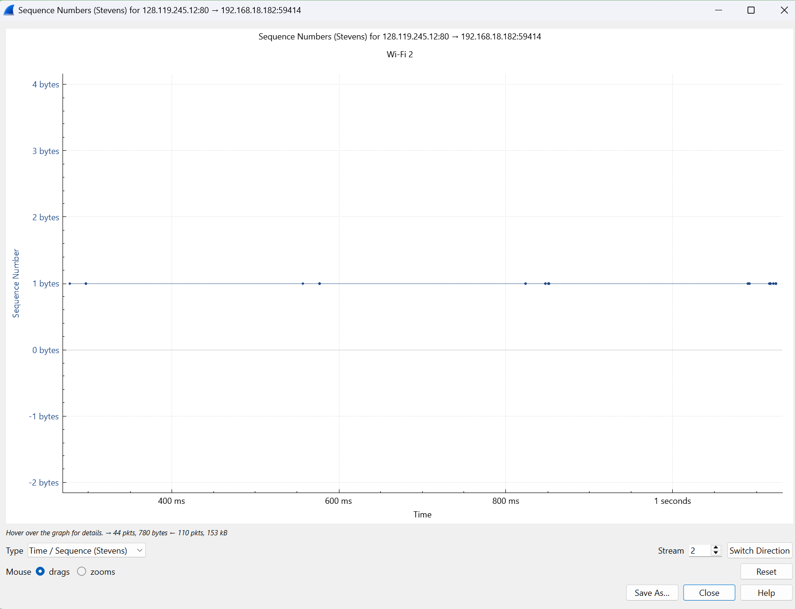
    dari grafik di atas tidak terlihat adanya slow start dan congestion avoidance
