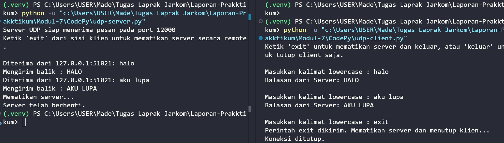
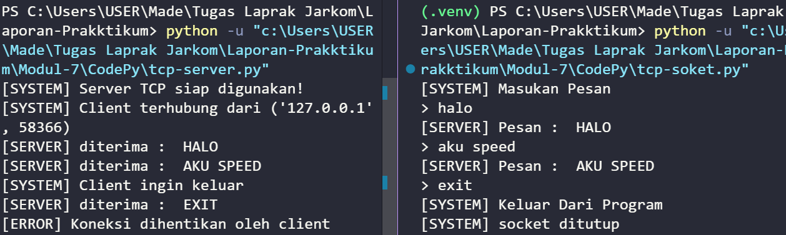

## Laporan Prakktikum Jaringan Komputer Modul 7 Terkait SOCKET PROGRAMMING: MEMBUAT APLIKASI JARINGAN 
- Nama          : I Made Sudiarte
- NIM           : 103072400044
- Kelas         : IF-04-05

## Tujuan Praktikum
1. Mahasiswa bisa membuat program berbasis socket UDP
2. Mahasiswa bisa membuat program berbasis socket TCP

## UDPClient.py
Berikut Codenya :
from socket import *
import sys

#Konfigurasi alamat dan port server
serverName = 'localhost'
serverPort = 12000

#Inisialisasi socket UDP di luar loop agar tidak dibuat berulang-ulang
clientSocket = socket(AF_INET, SOCK_DGRAM)
clientSocket.settimeout(5)  # Batas waktu tunggu 5 detik

print("Ketik 'exit' untuk mematikan server dan keluar, atau 'keluar' untuk tutup client saja.\n")

try:
    while True:
        # Input pesan dari pengguna
        message = input('Masukkan kalimat lowercase : ')
        
        # Validasi jika input kosong
        if not message:
            continue

        # Mengirim pesan ke server
        clientSocket.sendto(message.encode(), (serverName, serverPort))
        
        # Cek apakah pengguna ingin keluar
        if message.lower() == 'exit':
            print("Perintah exit dikirim. Mematikan server dan menutup klien...")
            break
        elif message.lower() == 'keluar':
            print("Menutup klien...")
            break
        
        try:
            # Menerima balasan dari server
            modifiedMessage, serverAddress = clientSocket.recvfrom(2048)
            print(f"Balasan dari Server: {modifiedMessage.decode()}\n")
        except timeout:
            print("Kesalahan : Server tidak merespons (Timeout).\n")

except Exception as e:
    print(f"Terjadi kesalahan : {e}")
finally:
    # Menutup koneksi socket secara permanen saat loop berhenti
    clientSocket.close()
    print("Koneksi ditutup.")

### Code diatas digunakan untuk mengirim pesan dari client ke server (kirim → tunggu → tampilkan → ulangi)

## UDPServer.py
Berikut codenya :

from socket import *
import sys

#Konfigurasi server

serverName = 'localhost'
serverPort = 12000
serverSocket = socket(AF_INET, SOCK_DGRAM)
serverSocket.bind(('', serverPort))

print(f"Server UDP siap menerima pesan pada port {serverPort}")
print("Ketik 'exit' dari sisi klien untuk mematikan server secara remote.\n")

try:
    while True:
        # Menerima pesan dari klien
        message, clientAddress = serverSocket.recvfrom(2048)
        
        # Mendekode pesan
        original_message = message.decode().strip()
        
        # Cek apakah pesan adalah perintah untuk keluar
        if original_message.lower() == 'exit':
            print(f"Mematikan server...")
            break
        
        # Mengubah pesan menjadi huruf kapital
        modifiedMessage = original_message.upper()
        
        # Menampilkan informasi klien dan isi pesan
        print(f"Diterima dari {clientAddress[0]}:{clientAddress[1]}: {original_message}")
        print(f"Mengirim balik : {modifiedMessage}")
        
        # Mengirim kembali pesan yang telah diubah ke klien
        serverSocket.sendto(modifiedMessage.encode(), clientAddress)
        
except Exception as e:
    print(f"\nTerjadi kesalahan : {e}")
finally:
    print("Server telah berhenti.")
    serverSocket.close()
    sys.exit(0)

### kode di atas digunakan untuk menerima pesan dari client → mengubah jadi huruf besar → kirim balik

## TCPClient.py
#Socket = penjumlahan, pembagian, pengurangan, perkalian
from socket import * 

serverName = "localhost"
serverPort = 12000

#AF_INET = ipv4 | Sock_stream = tcp
clientSocket = socket(AF_INET, SOCK_STREAM)

#hubungan

clientSocket.connect(
    (serverName, serverPort)
)

print("[SYSTEM] Masukan Pesan")

running = True

while running :
    try:
        massage = input("> ")
        
        # check exit sebelum send
        if massage.lower() == "exit" :
            clientSocket.send(massage.encode())
            print("[SYSTEM] Keluar Dari Program")
            running = False
            break
        
        clientSocket.send(massage.encode())
        
        modifiedMassage = clientSocket.recv(2048)
        print("[SERVER] Pesan : ", modifiedMassage.decode())
    except ConnectionResetError:
        print("[ERROR] Koneksi ditutup oleh server")
        break
    except Exception as e:
        print(f"[ERROR] {e}")
        break
        
    # menutup socket yang tidak dipakai
clientSocket.close()
print("[SYSTEM] socket ditutup")

## TCPServer.py
Berikut kodenya :
from socket import *

serverPort = 12000
serverSocket = socket(AF_INET, SOCK_STREAM)

#MENG BIND SERVER
serverSocket.bind(
    ('', serverPort)
)

#server siap menerima koneksi
serverSocket.listen(1)
print("[SYSTEM] Server TCP siap digunakan!")

running = True

while running:
    try:
        #menyetujui koneksi dari client
        conectionSocket, add = serverSocket.accept()
        print(f"[SYSTEM] Client terhubung dari {add}")

        while True:
            try:
                #pesan yang diterima = 10101010
                massage = conectionSocket.recv(2048)

                if not massage :
                    print("Client disconnect")
                    break
                massage = massage.decode()
                #cek apakah pesan = exit
                if massage.lower() == "exit":
                    print("[SYSTEM] Client ingin keluar")
                    running = False
                #memodif menjadi caplock
                modifierMassage = massage.upper()
                print("[SERVER] diterima : ", modifierMassage)

                #kirim ke client
                conectionSocket.send(
                    modifierMassage.encode()
                )
            except ConnectionAbortedError:
                print("[ERROR] Koneksi dihentikan oleh client")
                break
            except Exception as e:
                print(f"[ERROR] {e}")
                break

        conectionSocket.close()
    except Exception as e:
        print(f"[ERROR] Gagal menerima koneksi: {e}")
        continue

serverSocket.close()

### kode ini digunakan juga untuk mengirim pesan dari client ke server tapi dimodif dlu ma server pesannya
Dalam program ini, setelah mengirim kalimat yang dimodifikasi ke klien, kita menutup soket koneksi.
Tetapi karena serverSocket tetap terbuka, klien lain sekarang dapat mengetuk pintu dan mengirim
server sebuah kalimat untuk dimodifikasi

## Output dari program socket UDP
Output: 
    
## Output dari program socket  TCP
Output: 
    

