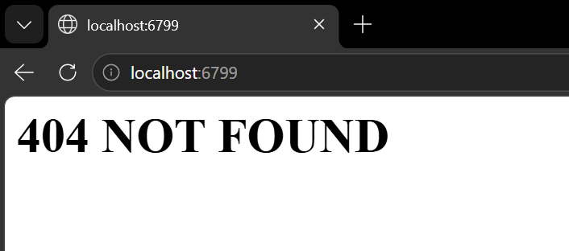
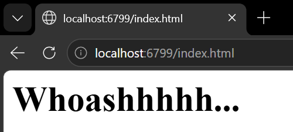

# Laporan Praktikum Jaringan Komputer Modul 9 - Web Server

## mempelajari dasar-dasar pemrograman soket untuk koneksi TCP
Python: cara membuat soket, mengikatnya ke alamat dan port tertentu, serta mengirim dan
menerima paket HTTP. 

1. Buat file bernama server.py, dengan code sebagai berikut :

```python
from socket import *
import threading

def handle_client(connectionSocket):
    try:
        #input user
        #decode = 10101010 -> "pesan"
        massage = connectionSocket.recv(1024).decode()

        #nampung req tipe file dari pengguna"
        fileName = massage.split()[1]
        print("REQUEST:", fileName) 

        #membuka index.html
        
        f = open(fileName[1:]) #pastikan folder tempat menyimpan file index.html sama dengan file server.py
        #membaca file html 
        outputData = f.read()

        #kirim respon
        connectionSocket.send(
            "HTTP/1.1 200 OK\r\n\r\n".encode()
        )

        #kirim data
        connectionSocket.sendall(outputData.encode())

    except IOError:
        connectionSocket.send(
            "HTTP/1.1 404 NOT FOUND\r\n\r\n".encode()
        )

        #kirim data
        connectionSocket.send(
            "<h1>404 NOT FOUND</h1>".encode()
        )

        ##TUTUP KONEKSI
        connectionSocket.close()

serverSocket = socket(AF_INET, SOCK_STREAM)
serverSocket.bind(('', 6799))
serverSocket.listen(5)#DAPAT MENERIMA SEBANYAK 5 CLIENT

print("[SYSTEM] Server is Running Away....")


while True:
    connectionSocket, add = serverSocket.accept()

    #membuat thread dan target threadnya, beserta parameternya
    thread = threading.Thread(
        target=handle_client,
        args=(connectionSocket,)
    )
    thread.start()
```

2. Buat file index.htmlnya (bebas sih namanya, yang penting html), untuk isinya bebas, contoh : <h1>Whoashhhhh...</h1>
3. Run file server.html
4. Pada halaman browser, serch localhost:'port yang dipake'/'nama file htmlnya', contoh 
    Hasil : 
5. Jika ingin pesan yang ditampilkan 404 Page Not Found, pada halaman browser serch localhost:'port yang dipake' atau localhost:'port yang dipake'/'nama file html yang belum dibuat', contoh : 

### Praktikum Pun Selesai, Pada praktikum ini kita diajari mengenai cara membuat server web sederhana

## Latihan 
1. Buat file server.py (codenya ada di atas)
    Jawab : [ini](<../Code PY/Modul9/server.py>)
2. Buat file index.html
    jawab : [ini](<../Code PY/Modul9/index.html>)
3. Run filenya
    Ini hasilnya : 

