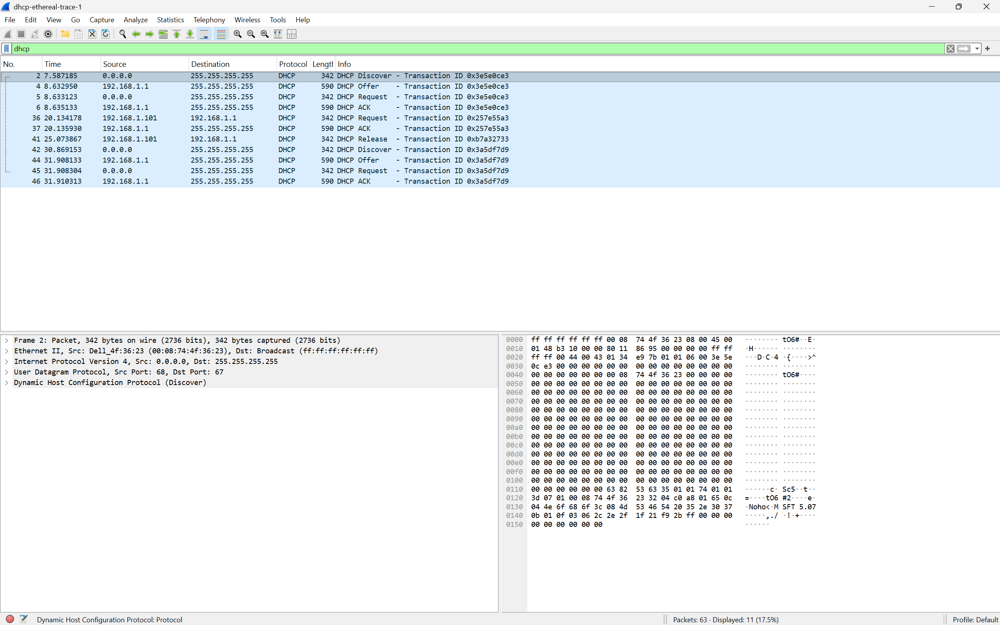

```
Nama    : I Made Sudiarte
NIM     : 103072400044
Kelas   : IF-04-05
```
# Laporan Praktikum Jaringan Modul 11 - DHCP

## A. Pengenalan
DHCP adalah singkatan dari Dynamic Host Configuration Protocol. DHCP adalah protokol yang digunakan untuk distribusi IP Address pada jaringan komputer secara dinamis. Dengan menggunakan DHCP Anda dapat melakukan konfigurasi IP address pada setiap perangkat di jaringan komputer secara otomatis.

 <br>Fungsi :
 ```
 1.  Mencegah Terjadinya Konflik IP
 2. Pembaruan IP Secara Otomatis
 3. Mendukung Penggunaan Kembali IP

 ```
 Kelebihan :
 ```
 1. Konfigurasi otomatis
 2. Efisien
 3. Pembaruan alamat IP otomatis
 ```
 
 Kekurangan :
 ```
 1. Ketergantungan pada server tunggal
 2. Resiko keamanan
 3. Kompleksitas dalam jaringan besar
 ```

 ## B. Dora
 DORA adalah singkatan dari Discover, Offer, Request, dan Acknowledgment. 
 1. Discover, client akan mengirim pesan kepada server untuk memberitahukan bahwa client tersebut butuh konfigurasi jaringan.
 2. Offer, server yang menerima pesan ini akan melakukan Offer yaitu membalas pesan tadi dengan mengirim DHCP Offer Message(konfigurasi jaringan yang tersedia). 
 3. Request, client akan melakukan Request yaitu membalas pesan dari server tadi dengan mengirim DHCP Request Message. 
 4. Acknowledgment, server akan melakukan Acknowledgment yaitu membalas kembali pesan dari client dengan mengirimkan DHCP Acknowledgment Message. 

 contoh :
 1. Download dan ekstrak file http://gaia.cs.umass.edu/wireshark-labs/wireshark-traces.zip
 2. Ekstrak
 3. Buka file dhcp-ethereal-trace-1 menggunakan wireshark
 4. lakukan filtering dengan kata dhcp, nanti akan ditampilkan proses dora tadi.
 hasil :
 

 # Lampiran
https://www.rumahweb.com/journal/dhcp-adalah/
https://widyasecurity.com/2025/07/21/kelebihan-dan-kekurangan-dhcp-server-untuk-jaringan/
https://www.ruangguru.com/blog/dhcp-server-client