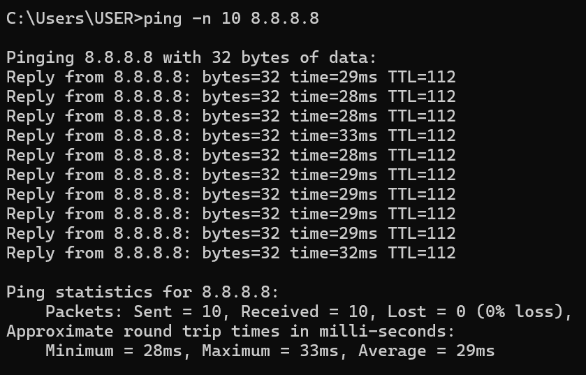
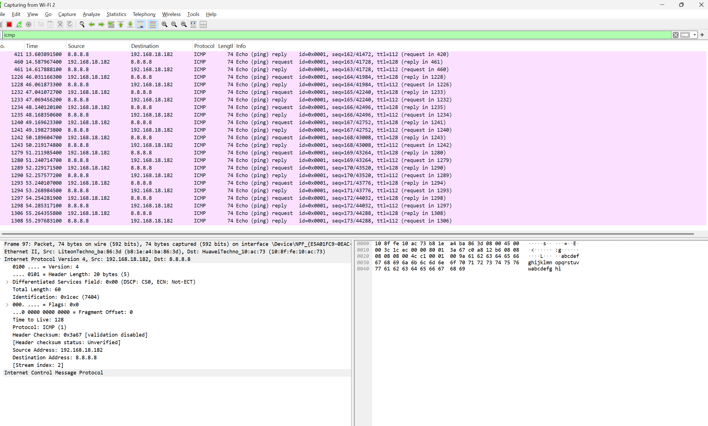
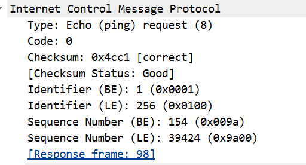
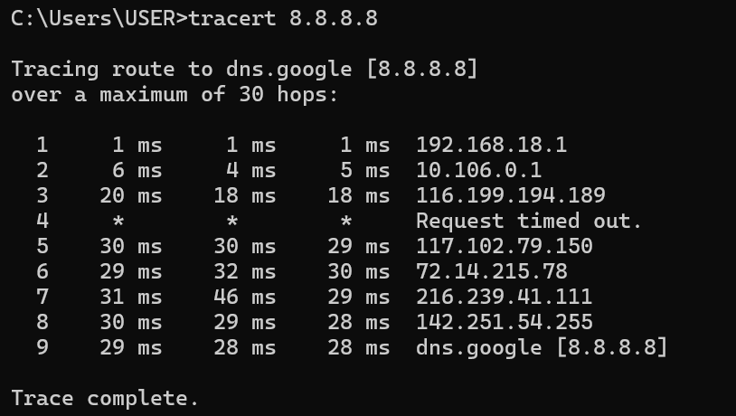
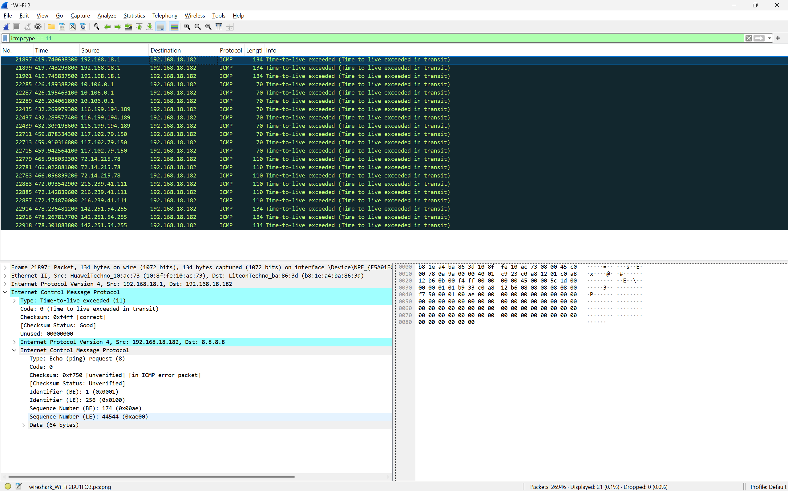
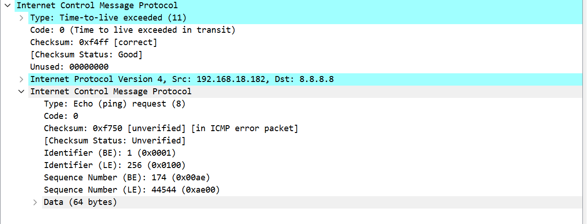

```
Nama    : I Made Sudiarte
NIM     : 103072400044
Kelas   : IF-04-05
```
# Laporan Praktikum Jaringan Modul 12 - ICMP
## Poin Yang Akan Dibahasa Pada Laporan Praktikum Ini
```
1. pesan ICMP yang dihasilkan oleh ping 
2. pesan ICMP yang dihasilkan oleh program  traceroute.
3. format dan pesan isi ICMP 
```
## A. Pengenalan
ICMP (Internet Control Message Protocol) merupakan protokol yang digunakan dalam jaringan berbasis IP untuk menyampaikan pesan kontrol dan informasi kesalahan antar perangkat jaringan, termasuk router.

Fungsi, yakni untuk memberikan informasi tentang status koneksi jaringan, mengirim pesan-pesan kesalahan, dan memberikan mekanisme untuk melakukan tes jaringan.

## B. Pesan ICMP Yang Dihasilkan Oleh Ping
1. Buka cmd pada leptop/komputer dan wireshark.
2. Pada cmd ketik, ping -n |jumlah tes ping| IP/alamat website yang ingin diping, contoh :
```
ping -n 10 8.8.8.8
```
3. Hasil ping :

semua ping berhasil tanpa rto
4. masuk ke wireshark.
5. lakukan filtering denngan kata:
```
icmp
```
6. Hasil :

*Pesan icmp : 

pesannya berisi :
```
Type: Echo (ping) request (8)
Code: 0
Checksum: 0x4cc1 [correct]
Identifier: 1 (0x0001)
...
Sequence Number: 154 (0x009a)
...
[Response frame: 98]
```

## C. Pesan ICMP Yang Dihasilkan Oleh Program Traceroute
1. Buka cmd pada leptop/komputer dan wireshark.
2. Pada cmd, ketik:
```
tracert 8.8.8.8
```
3. Hasil :

4. Pada wireshark lakukan filtering dengan kunci :
```
icmp.type == 11
```
5. Hasil :


*Pesan:


berikut pesan icmp yang dihasilkan oleh tracerouter

```
Internet Control Message Protocol
Type: Time-to-live exceeded (11)
Code: 0 (Time to live exceeded in transit)
...
```
berikut salinan paket yang dikirim oleh leptop/pc :
```
Internet Control Message Protocol
Type: Time-to-live exceeded (11)
Code: 0 (Time to live exceeded in transit)
...
``` 
Hasil pengamatan Wireshark menunjukkan adanya pesan ICMP Time Exceeded (Type 11, Code 0) yang dikirim oleh router ketika nilai TTL paket mencapai nol selama proses traceroute. Di dalam pesan tersebut juga terdapat salinan paket asli berupa ICMP Echo Request (Type 8, Code 0) yang dikirim oleh host sumber ke alamat tujuan 8.8.8.8. Informasi ini digunakan oleh traceroute untuk mengidentifikasi setiap hop yang dilalui paket dalam jaringan.

# Sumber:
https://it.telkomuniversity.ac.id/icmp-adalah/