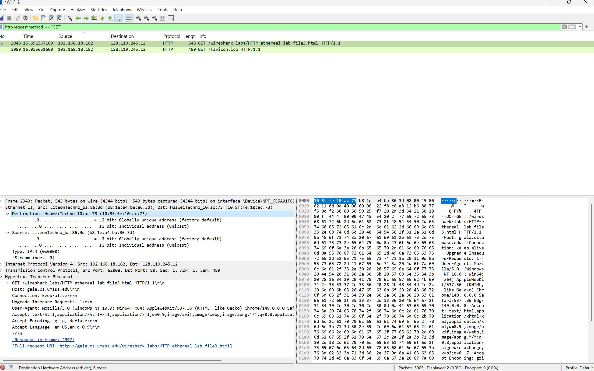
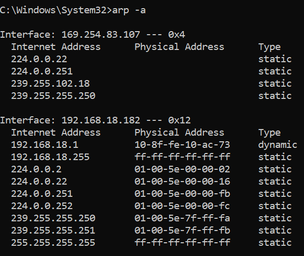
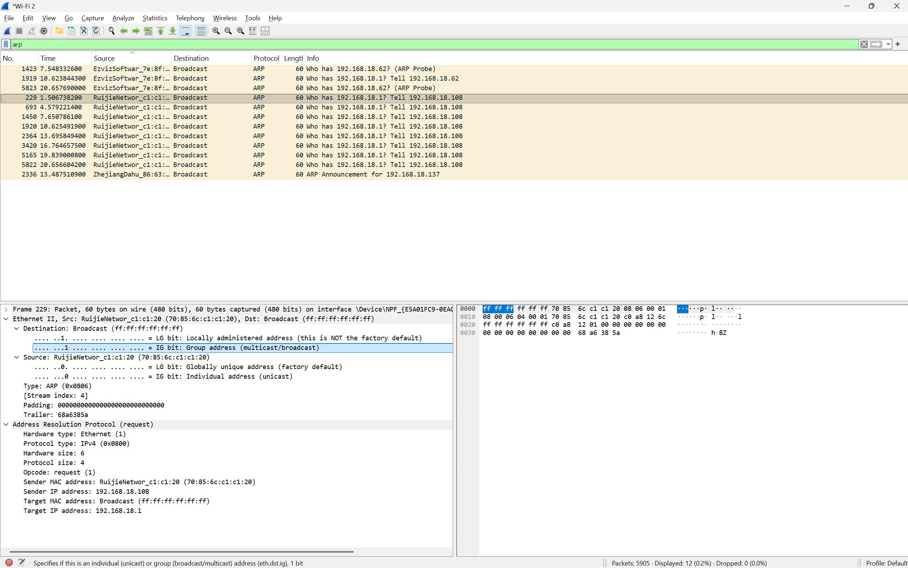

```
Nama    : I Made Sudiarte
NIM     : 103072400044
Kelas   : IF-04-05
```
# Laporan Praktikum Jaringan Modul 13 - Ethernet and ARP

## A. Pengantar
Ethernet adalah teknologi standar yang digunakan untuk menghubungkan perangkat ke dalam jaringan lokal (LAN), sedangkan ARP (Address Resolution Protocol) digunakan untuk menemukan alamat MAC perangkat dari alamat IP yang diketahui. Alamat MAC dipake buat komunikasi jaringan area lokal, ARP membantu kita untuk memperoleh informasi alamat MAC perangkat tujuan.

## B. Menangkap dan Menganalisis Frame Ethernet

1. Hapus cache browser terlebih dahulu
2. Buka wireshark, lalu lakukan capturing menggunakan interface yang dipake, wifi misalnya
3. Jika sudah akses web berikut sebagai contoh  http://gaia.cs.umass.edu/wireshark-labs/HTTP-ethereal-lab-file3.html
4. Stop capturing dan filtering menggunakan kata
```
http.request.method == "GET"
```
 untuk memudahkan mencarinya.

5. Hasil:

Pada frame nomor 2943 digunakan format Ethernet II. Alamat MAC tujuan adalah 10:8f:fe:10:ac:73 yang merupakan perangkat Huawei sebagai gateway jaringan, sedangkan alamat MAC sumber adalah b8:1e:a4:ba:86:3d yang berasal dari perangkat Liteon Technology. EtherType bernilai 0x0800 yang menunjukkan bahwa payload yang dibawa adalah paket IPv4. Paket IPv4 tersebut memiliki alamat sumber 192.168.18.182 dan alamat tujuan 128.119.245.12. Di dalamnya terdapat segmen TCP dengan port tujuan 80 yang digunakan oleh layanan HTTP. Payload TCP berisi metode HTTP GET untuk meminta file HTTP-ethereal-lab-file3.html pada server gaia.cs.umass.edu.

## C. Caching ARP
1. Untuk mengetahui cache arp pada windows, masuk ke cmd sebagai admin, lalu ketik :
```
arp -a
```
kemudian enter
Hasil :


2. Untuk mengahpus file cache arp pada windows, hal yang dilakukan adalah buka cmd sebagai admin, lalu ketik 
```
arp -d *
```
perintah tersebut akan mengapus semua entry arp.

## D. Mengamati ARP Di Wireshark
1. Hapus cache browser terlebih dahulu
2. Buka wireshark, lalu lakukan capturing menggunakan interface yang dipake, wifi misalnya
3. Masuk ke analyze -> enabled protocols -> cari ipv4 lalu un-centang -> klik ok.
3. Jika sudah akses web berikut sebagai contoh  http://gaia.cs.umass.edu/wireshark-labs/HTTP-ethereal-lab-file3.html
4. Stop capturing dan filtering menggunakan kata
```
arp
```
5. Hasil :

pada frame nomor 229 menunjukan arp, di mana alamat ip 192.168.18.188 ingin mengetahui alamat MAC dari ip 192.168.18.1.
