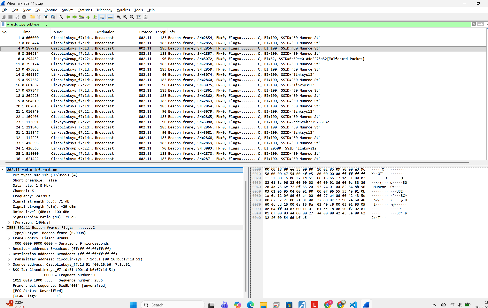
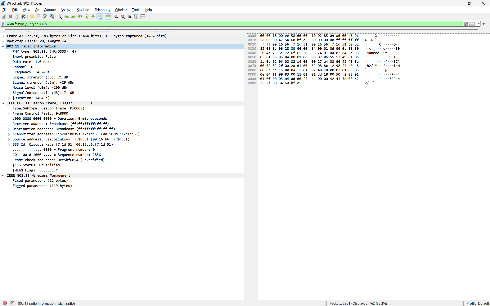
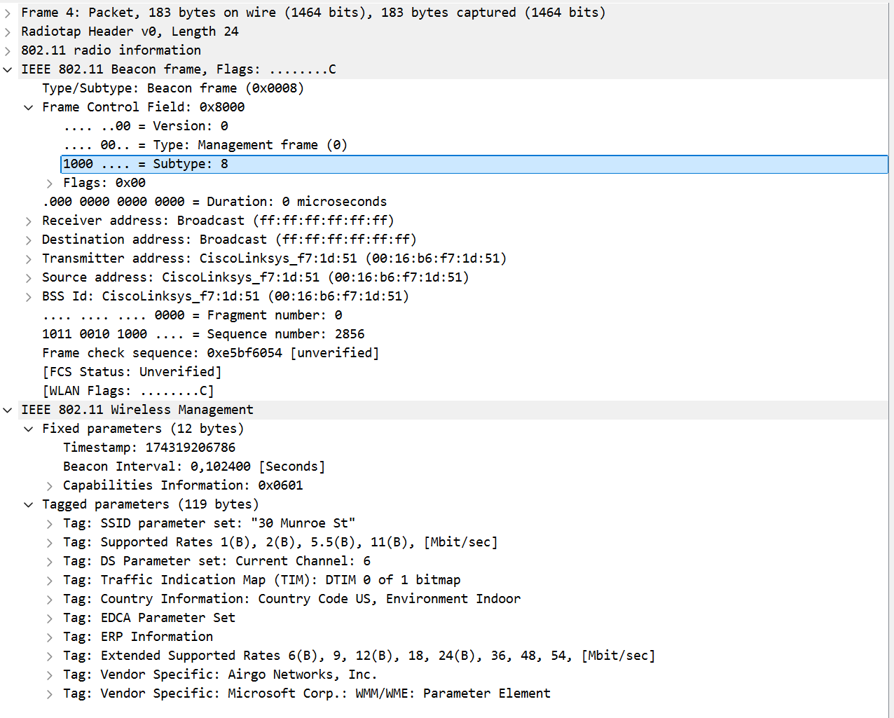
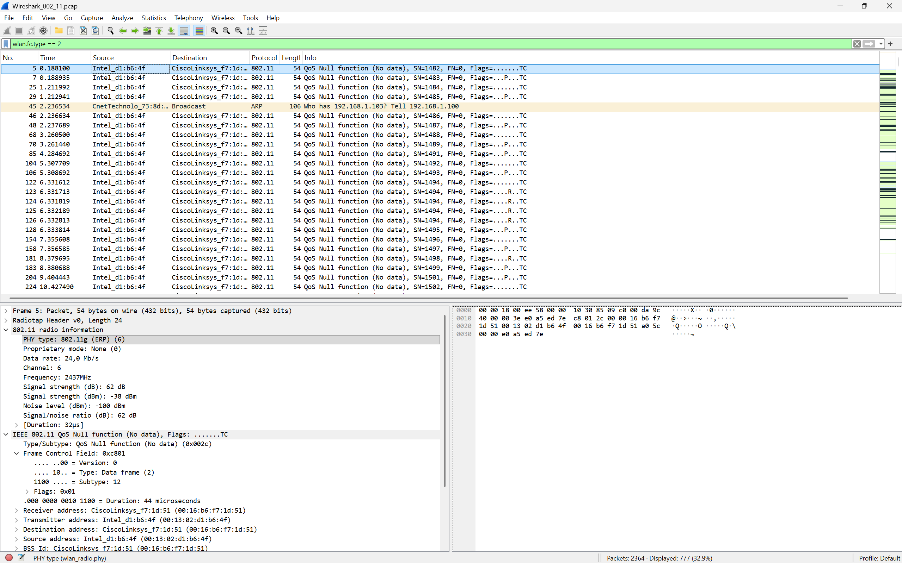
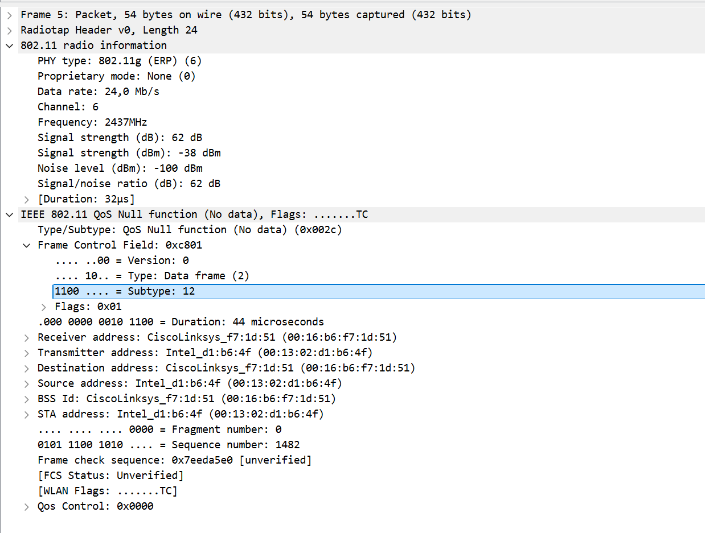
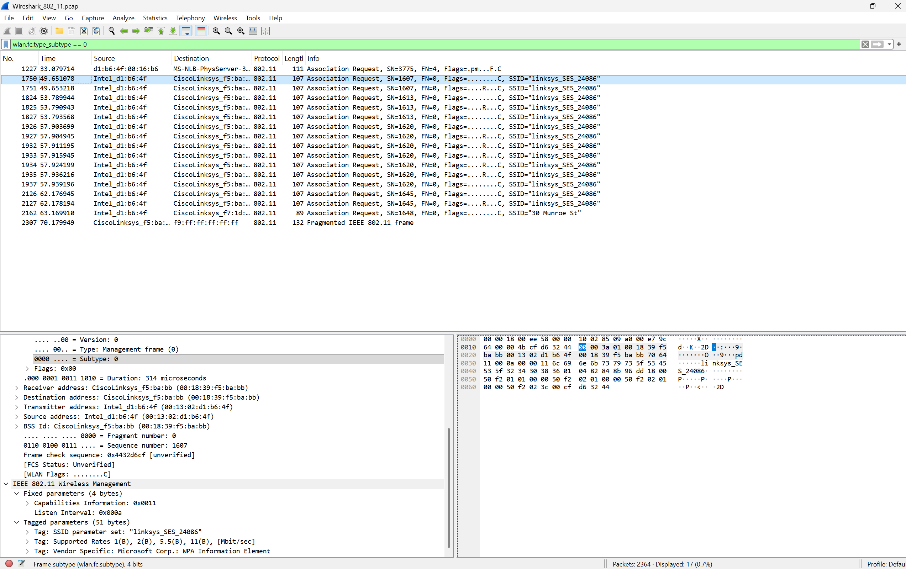
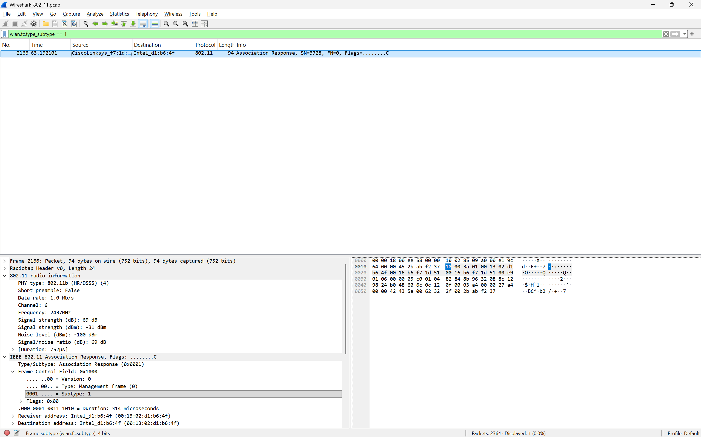
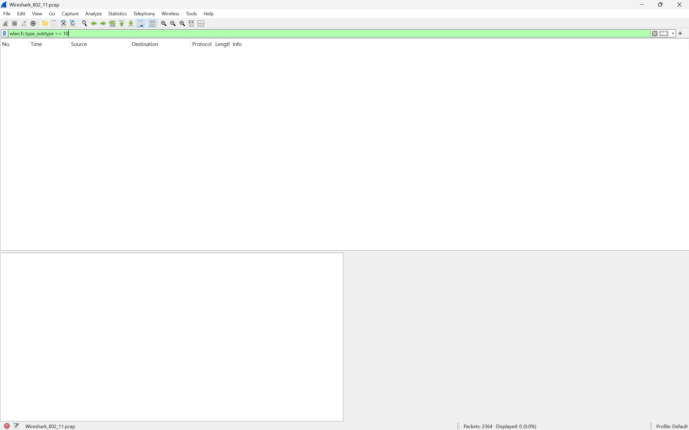

```
Nama    : I Made Sudiarte
NIM     : 103072400044
Kelas   : IF-04-05
```
# Laporan Praktikum Jaringan Modul 14 - WiFi

## A. Pengantar
Pada praktikum week 14 membahas seputar teknologi Wi-Fi 802.11 IEEE. IEEE 802.11 adalah serangkaian spesifikasi kendali akses medium dan lapisan fisik untuk mengimplementasikan komunikasi komputer Wireless network di frekuensi 2.4, 3.6, 5, dan 60 GHz. Jenis frame dari 802.11 yakni :
* Managenemt Frame
* Control Frame
* Data Frame

## B. Praktik
1. Download file zip http://gaia.cs.umass.edu/wireshark-labs/wireshark-traces.zip dan ekstrak filenya.
2. Buka file Wireshark_802_11 menggunakan wireshark, karena jika ingin melakukan capturing 802.11 IEEE adapter wifi pada device yang digunakan harus mendukung monitor mode, karena leptop saya adapter wifinya tidak mendukung hal tersebut, jadi kita pake file Wireshark_802_11 yang udah diekstrak tadi.
3. Jika sudah, lakukan filtering menggunakan :
```
wlan.fc.type_subtype == 8
```
4. Hasil :



## C. Beacon Frames
1. Dari praktik di atas, pilih 1 frame, lalu extend bagian IEEE 802.11 Beacon Frame
2. Hasil :

Hasil pengamatan pada IEE 802.11 Beacon Frame, Flags : ....... C:
* Type: Management frame (0)
Subtype: 8
yang berati itu beacon frame
* Receiver address: Broadcast (ff:ff:ff:ff:ff:ff), yang berarti beacon dikirim kesemua perangkat disekitar
* Destination address: Broadcast (ff:ff:ff:ff:ff:ff), tujuan frame
* Transmitter Address CiscoLinksys_f7:1d:51 (00:16:b6:f7:1d:51)
* Source Address (SA) CiscoLinksys_f7:1d:51(00:16:b6:f7:1d:51)
* BSSID: CiscoLinksys_f7:1d:51 (00:16:b6:f7:1d:51)

## D. Data Frame
1. 1. Download file zip http://gaia.cs.umass.edu/wireshark-labs/wireshark-traces.zip dan ekstrak filenya.
2. Buka file Wireshark_802_11 menggunakan wireshark, karena jika ingin melakukan capturing 802.11 IEEE adapter wifi pada device yang digunakan harus mendukung monitor mode, karena leptop saya adapter wifinya tidak mendukung hal tersebut, jadi kita pake file Wireshark_802_11 yang udah diekstrak tadi.
3. Jika sudah, lakukan filtering menggunakan :
```
wlan.fc.type == 2
```

4. Sebagai contoh pilih frame 5, lalu extend pada bagian 802.11 radio information dan IEEE 802.11 QoS NULL function (No data)...


## E. Association/Disassociation

1. Association Request
berikut caranya :
* Download file zip http://gaia.cs.umass.edu/wireshark-labs/wireshark-traces.zip dan ekstrak filenya.
* Buka file Wireshark_802_11 menggunakan wireshark, karena jika ingin melakukan capturing 802.11 IEEE adapter wifi pada device yang digunakan harus mendukung monitor mode, karena leptop saya adapter wifinya tidak mendukung hal tersebut, jadi kita pake file Wireshark_802_11 yang udah diekstrak tadi.
* Jika sudah, lakukan filtering menggunakan :
```
wlan.fc.type_subtype == 0
```
* Hasil :


2. Association Response
* lakukan filtering menggunakan :
```
wlan.fc.type_subtype == 1
```
* Hasil :


Association request dikirim oleh client (laptop/HP) ke Access Point untuk meminta bergabung ke jar, dan Association response adalah balasan dari Access Point terhadap Association Request.

3. Disassociation, yakni memberitahu bahwa hubungan antara client dan AP diakhiri.
untuk filteringnya :
```
wlan.fc.type_subtype == 10
```
hasil :

kosong karena tidak ada proses dissassociation